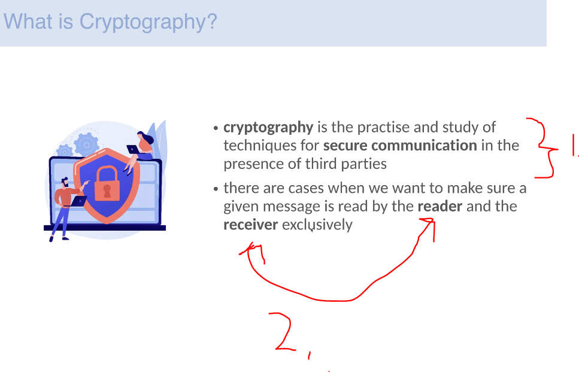
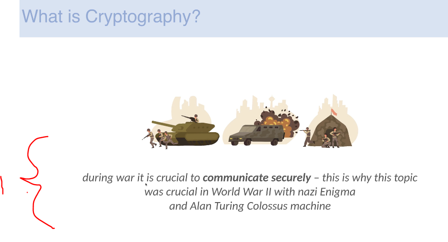
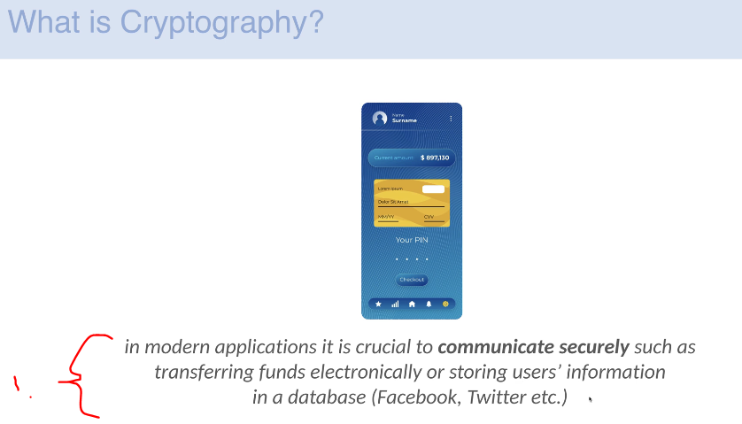
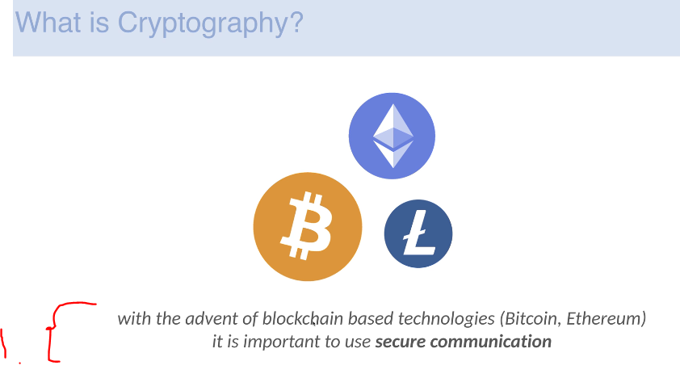
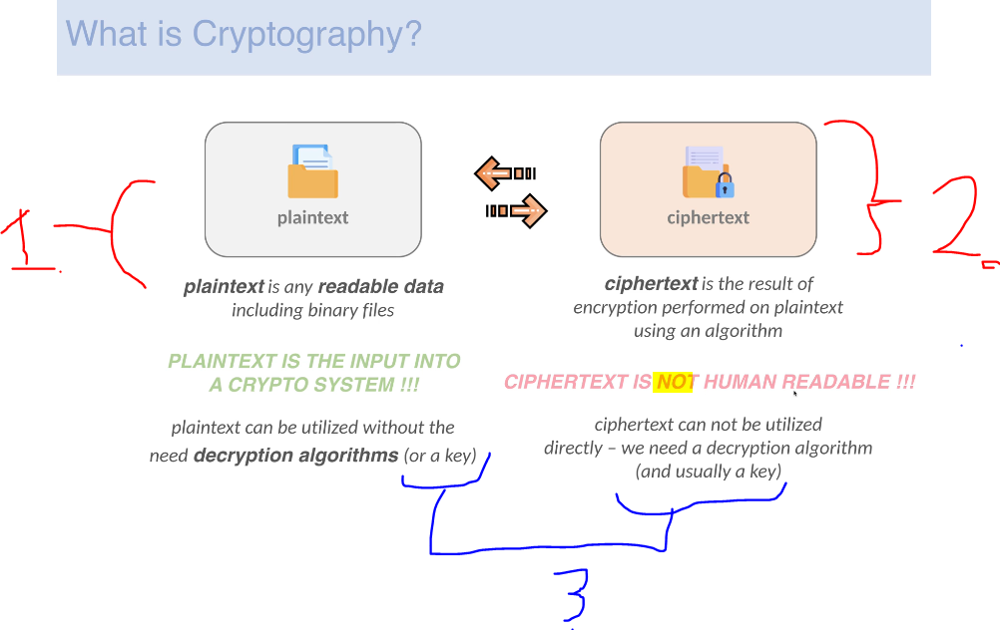
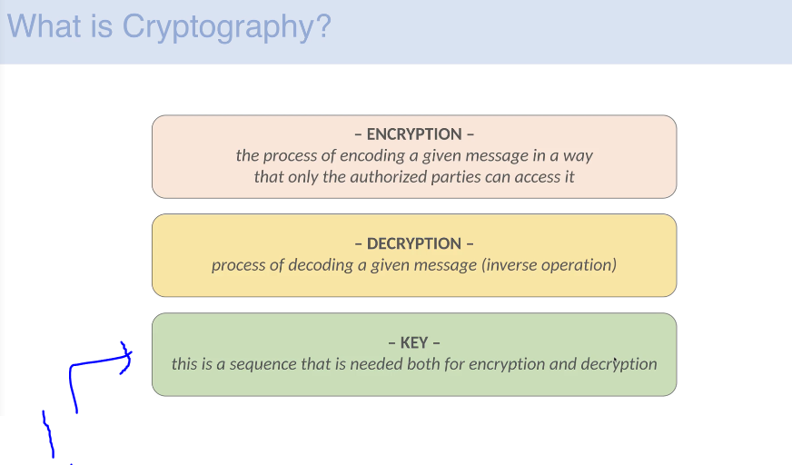
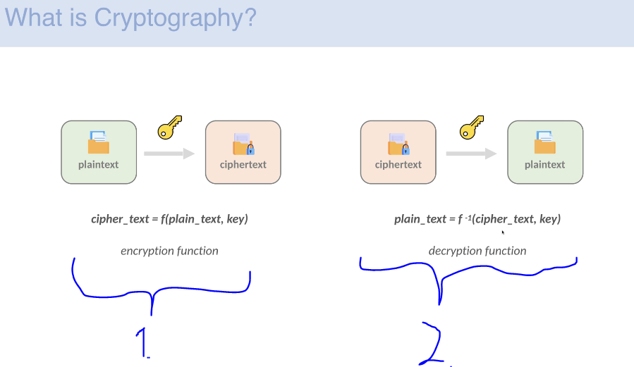
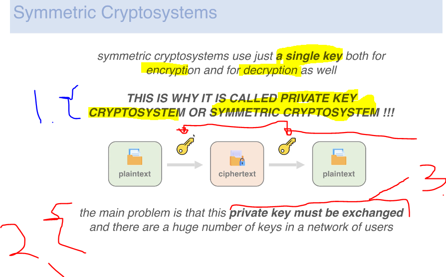
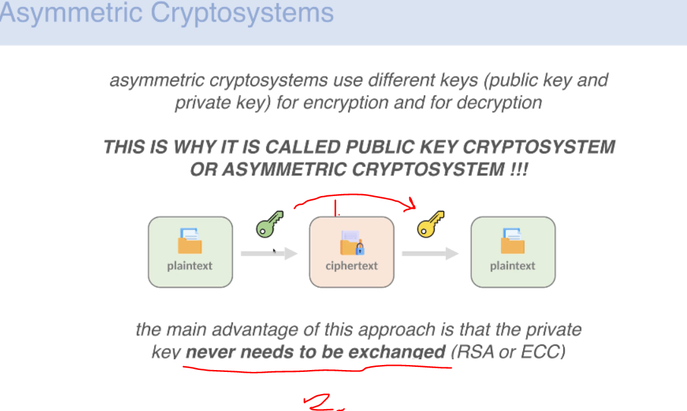
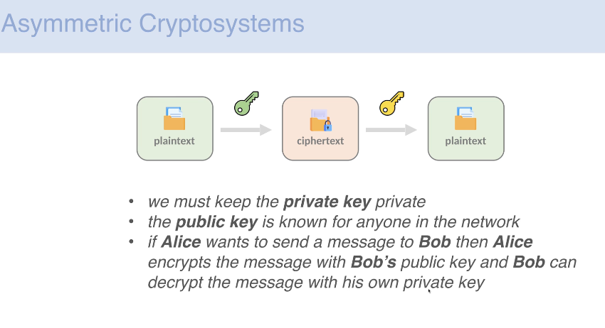

# Section 02: Cryptography Fundamentals.

Cryptography Fundamentals.

# What I Learned.

# What is cryptography?

    

    

1. The act of **secure** communication in presence of **third party**.

2. The **reader** and **receiver** can read this message only!

    

1. One application for the **Cryptology** is for war!

    

1. Also when saving data to database or sending data over internet!

    

1. This is **heavily** useful when applying them in **Blockchain**, like **Bitcoin** and **Ethereum**.
    - These are using **E**lliptic **C**urve **C**ryptography.

    

1. **Plain Text** is any **readable data**!
    - This will be the **input** for the **crypto system**!
2. **Ciphertext** is outcome of using an **algorithm** for the **Plain Text**!

3. We can **decrypt** and **crypt** messages. These usually involves **key** and **algorithm** should be known!

    

1. This is needed for the **encryption** and **decryption**.

    

1. We can conclude that **encryption** is a **function**.
    - `cipher_text=f(plain_text,key)`.
        - `plain text`.
        - `private_key`.
    - We can create **encrypted output** from this.

2. We can conclude that **decryption** is also a function **inverse**.
    - `plain_text=f⁻¹(cipher_text,key)`.
        - `cipher_text`
        - `private_key`

# Symmetric encryption.

    

1. When **both** **encryption** and **decryption** are using **same key** are the same, these are called `Symmetric cryptosystem`

    

1. When there is **single key** for the **encryption** and **decryption** These can be called:
    - `Private Key Cryptosystem` or `Symmetric Cryptosystem`

> [!IMPORTANT]  
> Notice the, they have the **same key** for **encryption** and **decryption**!

2. Symmetric keys come with one weakness!
    - The **Private Key must be exchanged**!
        - These come **present** in systems like **Ethereum**.

- **Symmetric Cryptosystem** needs a lot of **Unique Private Keys** for the **Encryption** and **Decryption**! 

- Some famous Cryptosystems, which are **Symmetric Cryptosystems** are:
    - **Caesar system**.
    - **DES** (**D**ata **E**ncryption **S**tandard).

# Asymmetric encryption.

    

1. The `A` means **not** or **opposite of**!
2. **Public key** for **encryption**.
3. **Private key** for **decryption**.

    

1. **Private key** can be retrieved from the **Public key**, but it takes time.
2. **Private key**s never need to be exchanged.

    

    

1. **Private key** must be private!  
    - The **public key** is known for anyone in the network  
    - If **Alice** wants to send a message to **Bob**, then **Alice** encrypts the message with **Bob’s public key**, and **Bob** can decrypt the message with his own **private key**.