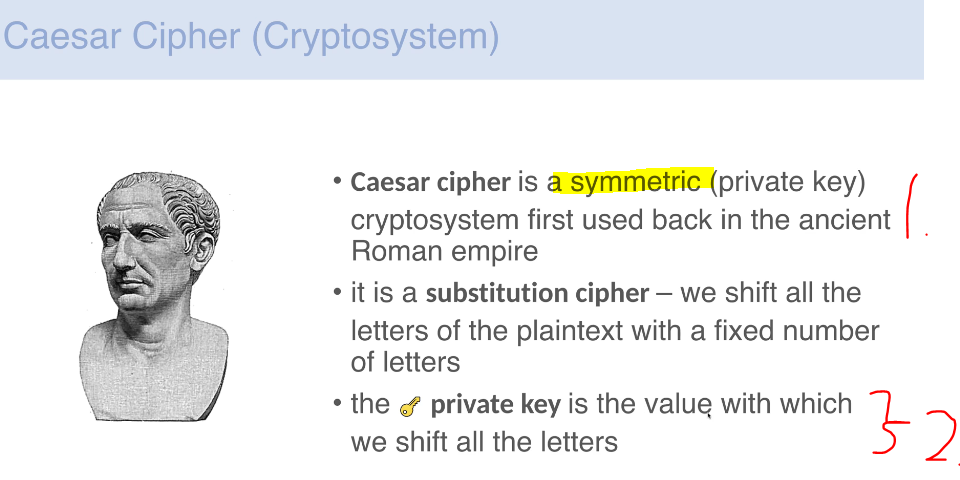
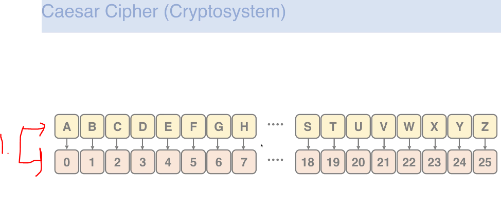
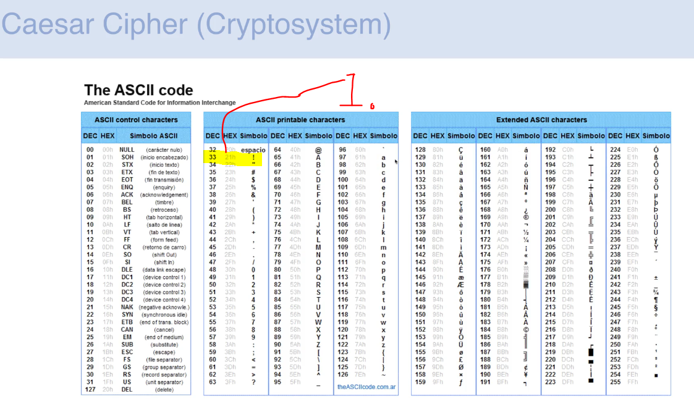
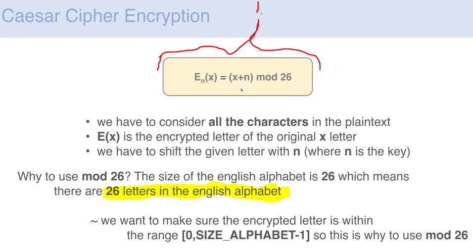
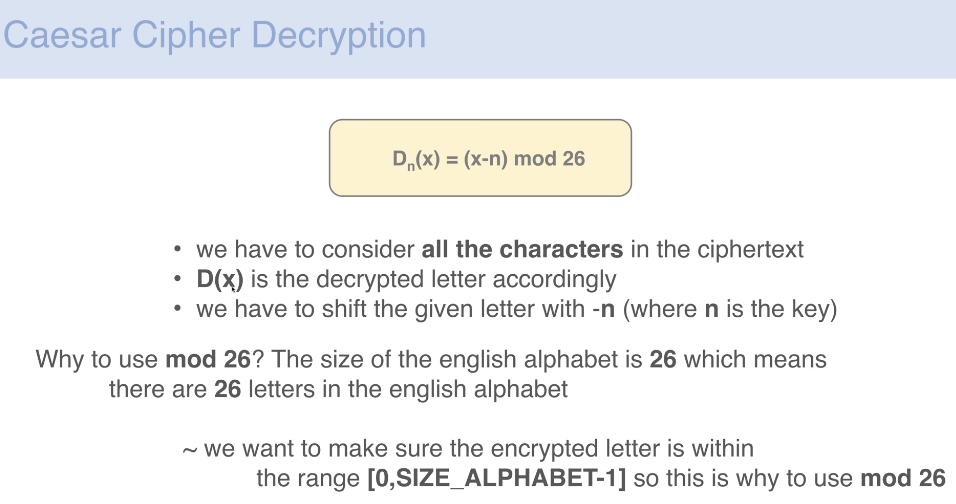

# Section 04: Caesar Cipher.

Caesar Cipher.

# What I Learned.

    

1. **Ceasar Cipher** is **Symmetric Crypto System**. 
2. The **private key** is the value, in which we shift all the letters! 

    

1. We are assigning **number** to each **character** in **English alphabet**!

    

1. **ASCII** table can be used to present **special keys**.
    - `!` is `33`.
    

    

1. Before the **arithmetic** operations can be taking place, we need to transfer input into **numerical** form.

    

