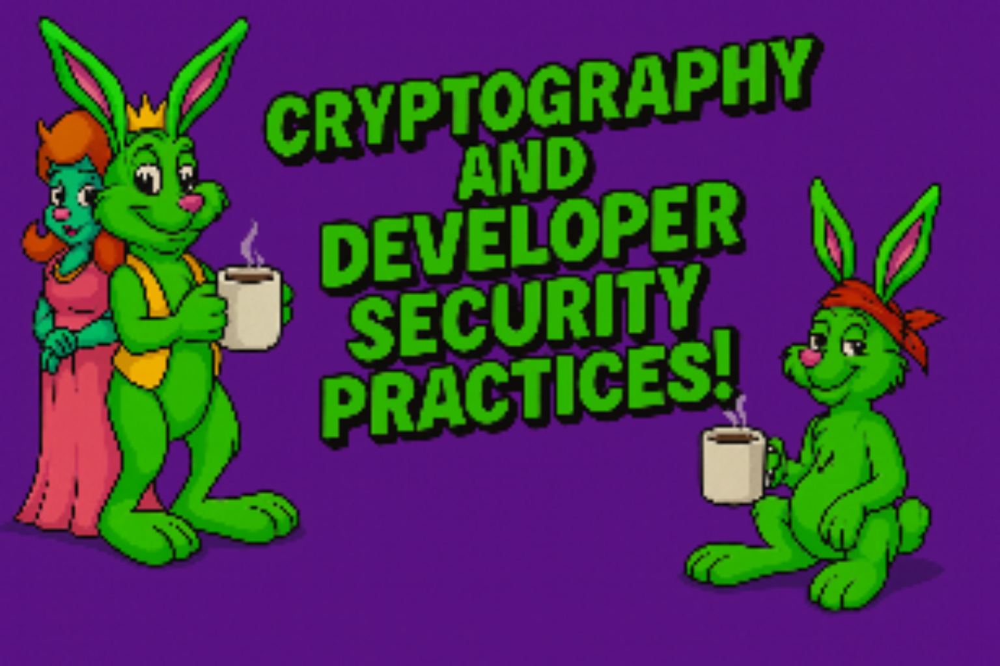
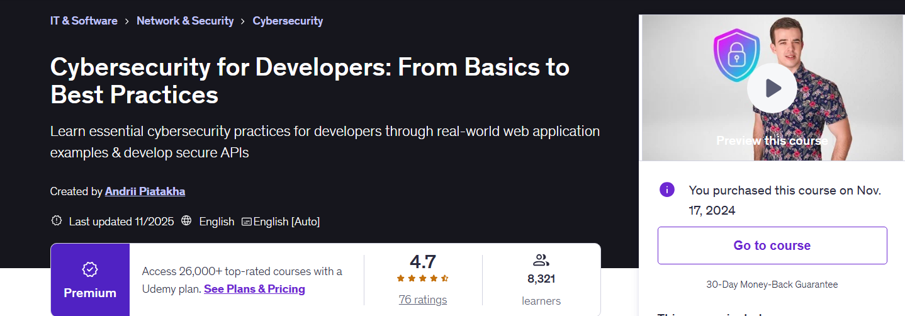
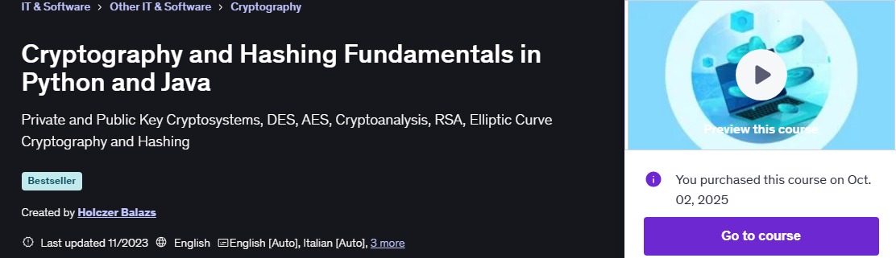
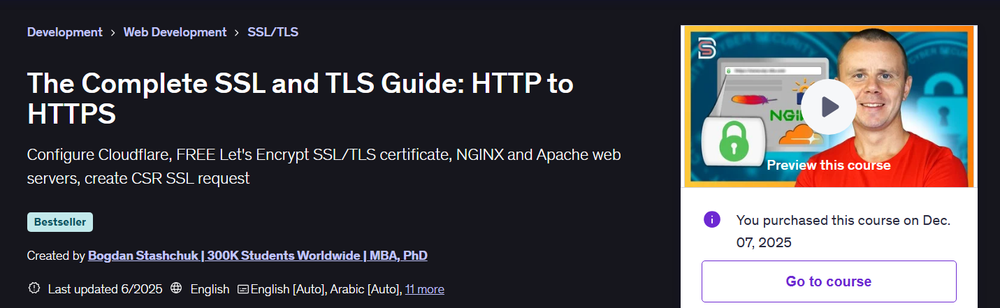

    
    <text>SSL/TLS, cryptography, and developer security practices!</text>

   

- For these courses one should configure **GIT** for handle projects.
    - `git config --global http.postBuffer 524288000`.
    - `git config --global core.longpaths true`.

    

All course material from Cybersecurity for Developers: From Basics to Best Practices 
by **Andrii Piatakha** ©. 

Contains my own notes with some course material to enforce learning experience. 

This repository is made with , therefore it will include configuration files which are related to this IDE this approach will be favored for now. ⚙️ 

 [The course at Udemy](https://www.udemy.com/course/cybersecurity-learnit/). 

[Content maker](https://it-bulls.com/).

If the content sparked :fire: your interest, please consider buying the course and start learning :book:.

<!-- 
Linkedin puts this shit front, when clicking from private mode x(. Need to put this to make jump working every case
?trk=public_profile_see-credential 
-->

    Insert certificate here when completed

**Note: The material provided in this repository is only for helping those who may get stuck at any point of time in the course. It is very advised that no one should just copy the solutions(violation of Honor Code) presented here.**

#### Progress/Curriculum.

- [x] [Section 01](#) - .

#### Additional stuff.

- [ ] stuff.

    

    

All course material from Cryptography and Hashing Fundamentals in Python and Java **Holczer Balazs** ©.

Contains my own notes with some course material to enforce learning experience.

This repository is made with , therefore it will include configuration files which are related to this IDE this approach will be favored for now. ⚙️

[The course at Udemy](https://www.udemy.com/course/learn-cryptography-basics-in-python/).

If the content sparked :fire: your interest, please consider buying the course and start learning :book:

<!-- 
Linkedin puts this shit front, when clicking from private mode x(. Need to put this to make jump working every case
?trk=public_profile_see-credential 
-->

    Insert certificate here when completed

**Note: The material provided in this repository is only for helping those who may get stuck at any point of time in the course. It is very advised that no one should just copy the solutions(violation of Honor Code) presented here.**

#### Progress/Curriculum.

- [x] [Section 01](https://github.com/developersCradle/spring-springboot-angular-microservices-mysql-java-persistence-hibernate-aws/tree/main/Cryptography%20and%20Hashing%20Fundamentals%20in%20Python%20and%20Java/Section%2001#section-01-introduction) - Introduction. ✅
- [x] [Section 02](https://github.com/developersCradle/spring-springboot-angular-microservices-mysql-java-persistence-hibernate-aws/tree/main/Cryptography%20and%20Hashing%20Fundamentals%20in%20Python%20and%20Java/Section%2002#section-02-cryptography-fundamentals) - Cryptography Fundamentals. ✅
- [x] [Section 03](#) - Symmetric (Private Key) Cryptography. ✅
- [ ] [Section 04](#) - Caesar Cipher.
- [ ] [Section 05](#) - Cracking Caesar Cipher & Detecting Languages.
- [ ] [Section 06](#) - Vigenere Cipher.
- [ ] [Section 07](#) - Cracking the Vigenere Cipher (Kasiski Algorithm).
- [ ] [Section 08](#) - One Time Pad (Vernam Cipher).
- [ ] [Section 09](#) - Randomness in Cryptography.
- [ ] [Section 10](#) - Data Encryption Standard (DES).
- [ ] [Section 11](#) - Cracking Data Encryption Standard (DES).
- [ ] [Section 12](#) - Advanced Encryption Standard (AES).
- [ ] [Section 13](#) - Cracking Advanced Encryption Standard (AES).
- [ ] [Section 14](#) - Asymmetric (Public Key) Cryptography.
- [ ] [Section 15](#) - Asymmetric Cryptosystems.
- [ ] [Section 16](#) - Modular Arithmetic.
- [ ] [Section 17](#) - Diffie-Hellman Key Exchange.
- [ ] [Section 18](#) - Cracking Diffie-Hellman Cryptosystem.
- [ ] [Section 19](#) - RSA Cryptosystem.
- [ ] [Section 20](#) - Cracking RSA.
- [ ] [Section 21](#) - Elliptic Curve. Cryptography (ECC).
- [ ] [Section 22](#) - Elliptic Curve Digital Signature Algorithm (ECDSA).
- [ ] [Section 23](#) - Hashing.
- [ ] [Section 24](#) - Hashing Algorithms Implementation (Python).
- [ ] [Section 25](#) - Hashing Algorithms Implementation (Java).
- [ ] [Section 26](#) - Applications of Cryptography.
- [ ] [Section 27](#) - Course Materials (Downloads).

#### Additional stuff.

- [ ] Do the basic Caesar cipher.
- [ ] Same with C++.

    

    

<!-- 
All course material from Cryptography and Hashing Fundamentals in Python and Java **Holczer Balazs** ©.

Contains my own notes with some course material to enforce learning experience.

This repository is made with , therefore it will include configuration files which are related to this IDE this approach will be favored for now. ⚙️

[The course at Udemy](https://www.udemy.com/course/learn-cryptography-basics-in-python/).

If the content sparked :fire: your interest, please consider buying the course and start learning :book: -->

<!-- 
Linkedin puts this shit front, when clicking from private mode x(. Need to put this to make jump working every case
?trk=public_profile_see-credential 
-->

    Insert certificate here when completed

**Note: The material provided in this repository is only for helping those who may get stuck at any point of time in the course. It is very advised that no one should just copy the solutions(violation of Honor Code) presented here.**

#### Progress/Curriculum.

- [x] [Section 01](#) -. 

#### Additional stuff.

- [ ] Add here.

