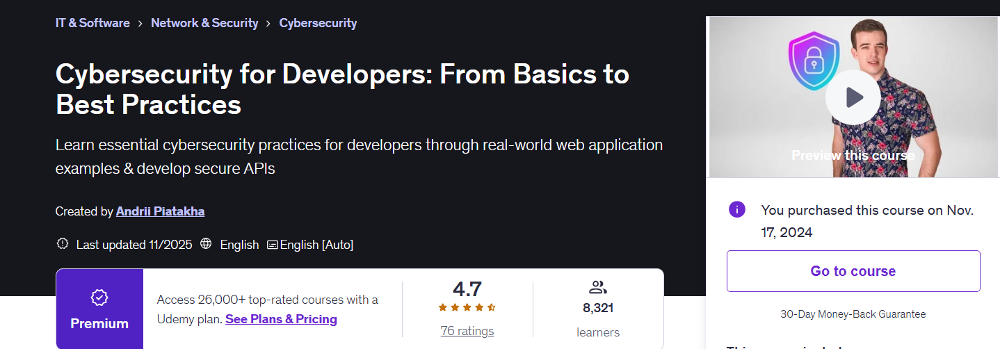
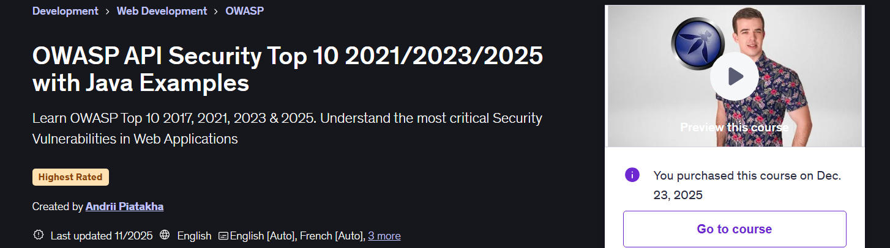
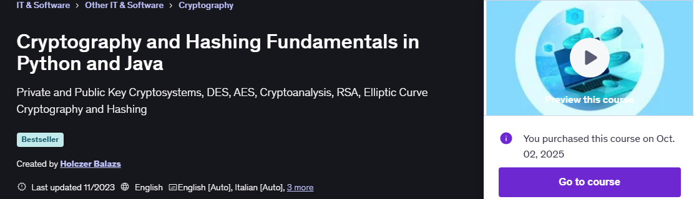
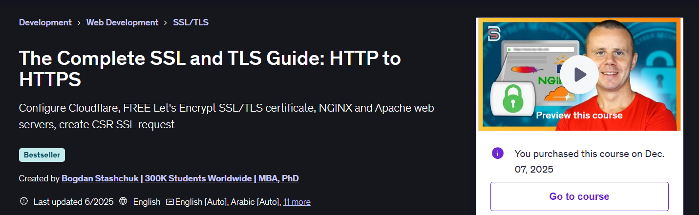
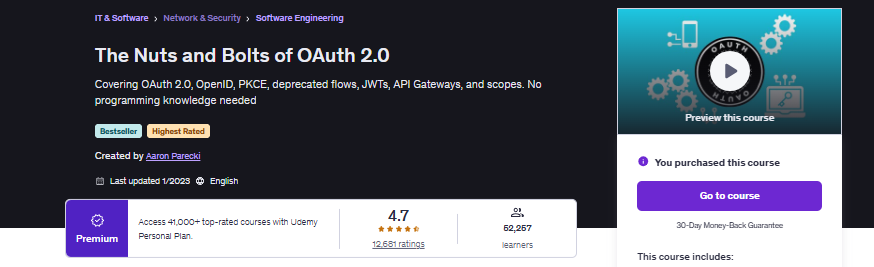
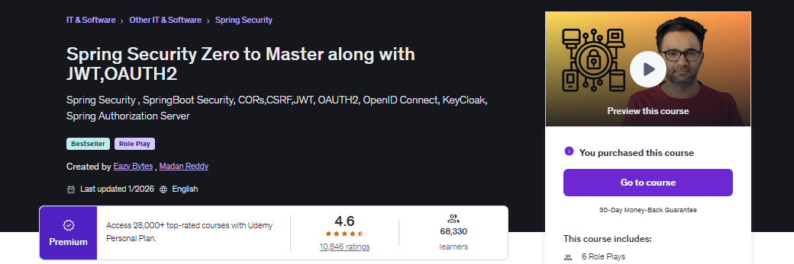
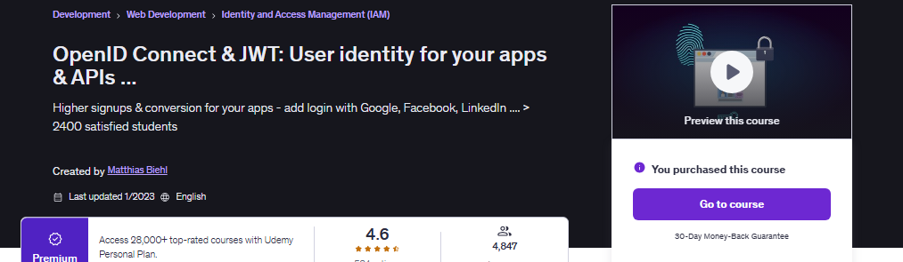

<!-- 

We are using following structure:

    

 

    

-->

      
    <text> <b>SSL/TLS</b>, <b>cryptography</b>, and <b>developer security practices</b>!</text>

   

- For these courses one should configure **GIT** for handle projects.
    - `git config --global http.postBuffer 524288000`.
    - `git config --global core.longpaths true`.

# Cybersecurity for Developers: From Basics to Best Practices.

    

All course material from *Cybersecurity for Developers: From Basics to Best Practices* by **Andrii Piatakha** ©. 

> Some story of victory here! 🐟  
> ~ *DevelopersCradle*

Contains my own with my own visual notes ✍️ with some course material to enforce learning experience.

This repository is made with  with  hotkeys, therefore it will include configuration files which are related to this IDE this approach will be favored for now. ⚙️

[The course at Udemy](https://www.udemy.com/course/cybersecurity-learnit/). 

[Content maker](https://it-bulls.com/).

If the content sparked :fire: your interest, please consider buying the course and start learning :book:.

<!-- 
Linkedin puts this shit front, when clicking from private mode x(. Need to put this to make jump working every case
?trk=public_profile_see-credential 
-->

    Insert certificate here when completed

**Note: The material provided in this repository is only for helping those who may get stuck at any point of time in the course. It is very advised that no one should just copy the solutions(violation of Honor Code) presented here.**

#### Progress/Curriculum.

- [x] [Section 01](#) - .

#### Additional stuff.

- [ ] stuff.

    

    

All course material from *OWASP API Security Top 10 2021/2023/2025 with Java Examples* by **Andrii Piatakha** ©. 

> Some story of victory here! 🐟  
> ~ *DevelopersCradle*

Contains my own with my own visual notes ✍️ with some course material to enforce learning experience.

This repository is made with  with  hotkeys, therefore it will include configuration files which are related to this IDE this approach will be favored for now. ⚙️

 [The course at Udemy](https://www.udemy.com/course/owasp-learnit/). 

[Content maker](https://it-bulls.com/).

If the content sparked :fire: your interest, please consider buying the course and start learning :book:.

<!-- 
Linkedin puts this shit front, when clicking from private mode x(. Need to put this to make jump working every case
?trk=public_profile_see-credential 
-->

    Insert certificate here when completed

**Note: The material provided in this repository is only for helping those who may get stuck at any point of time in the course. It is very advised that no one should just copy the solutions(violation of Honor Code) presented here.**

#### Progress/Curriculum.

- [ ] [Section 01](#) - Introduction. ⚠️ In progress! ⚠️
- [ ] [Section 02](#) - OWASP Top 10. ⚠️ In progress! ⚠️
- [ ] [Section 03](#) - A01:2021-Broken Access Control. ⚠️ In progress! ⚠️
- [ ] [Section 04](#) - A02:2021-Cryptographic Failures. ⚠️ In progress! ⚠️
- [ ] [Section 05](#) - A03:2021-Injection. ⚠️ In progress! ⚠️
- [ ] [Section 06](#) - A04:2021-Insecure Design. ⚠️ In progress! ⚠️
- [ ] [Section 07](#) - A05:2021-Security Misconfiguration. ⚠️ In progress! ⚠️
- [ ] [Section 08](#) - A06:2021-Vulnerable and Outdated Components. ⚠️ In progress! ⚠️
- [ ] [Section 09](#) - A07:2021-Identification and Authentication Failures. ⚠️ In progress! ⚠️
- [ ] [Section 10](#) - A08:2021-Software and Data Integrity Failures. ⚠️ In progress! ⚠️
- [ ] [Section 11](#) - A09:2021-Security Logging and Monitoring Failures. ⚠️ In progress! ⚠️
- [ ] [Section 12](#) - A10:2021-Server-Side Request Forgery. ⚠️ In progress! ⚠️
- [ ] [Section 13](#) - OWASP API Security Top 10 2023. ⚠️ In progress! ⚠️
- [ ] [Section 14](#) - OWASP Top 10 2025: LLM. ⚠️ In progress! ⚠️
- [ ] [Section 15](#) - Cybersecurity Comprehensive Security Practices for Developers. ⚠️ In progress! ⚠️
- [ ] [Section 16](#) - 🧪 EXAM TASK: OWASP Top 10, Secure Coding & Logging. ⚠️ In progress! ⚠️
- [ ] [Section 17](#) - Resilient, Scalable & Secure Systems with Spring Boot. ⚠️ In progress! ⚠️
- [ ] [Section 18](#) - Extra Materials: AI Cybersecurity Solutions. ⚠️ In progress! ⚠️
- [ ] [Section 19](#) - Bonus Section. ⚠️ In progress! ⚠️

#### Additional stuff.

- [ ] stuff.

    

    

All course material from *Cryptography and Hashing Fundamentals in Python and Java* **Holczer Balazs** ©.

> Some story of victory here! 🐟  
> ~ *DevelopersCradle*

Contains my own with my own visual notes ✍️ with some course material to enforce learning experience.

This repository is made with  with  hotkeys, therefore it will include configuration files which are related to this IDE this approach will be favored for now. ⚙️

[The course at Udemy](https://www.udemy.com/course/learn-cryptography-basics-in-python/).

If the content sparked :fire: your interest, please consider buying the course and start learning :book:

<!-- 
Linkedin puts this shit front, when clicking from private mode x(. Need to put this to make jump working every case
?trk=public_profile_see-credential 
-->

    Insert certificate here when completed

**Note: The material provided in this repository is only for helping those who may get stuck at any point of time in the course. It is very advised that no one should just copy the solutions(violation of Honor Code) presented here.**

#### Progress/Curriculum.

- [x] [Section 01](https://github.com/developersCradle/web-security-and-cryptography/tree/main/Cryptography%20and%20Hashing%20Fundamentals%20in%20Python%20and%20Java/Section%2001#section-01-introduction) - Introduction. ✅
- [x] [Section 02](https://github.com/developersCradle/web-security-and-cryptography/tree/main/Cryptography%20and%20Hashing%20Fundamentals%20in%20Python%20and%20Java/Section%2002#section-02-cryptography-fundamentals) - Cryptography Fundamentals. ✅
- [x] [Section 03](#) - Symmetric (Private Key) Cryptography. ✅
- [ ] [Section 04](https://github.com/developersCradle/web-security-and-cryptography/tree/main/Cryptography%20and%20Hashing%20Fundamentals%20in%20Python%20and%20Java/Section%2004#section-04-caesar-cipher) - Caesar Cipher. ⚠️ In progress! ⚠️
- [ ] [Section 05](https://github.com/developersCradle/web-security-and-cryptography/tree/main/Cryptography%20and%20Hashing%20Fundamentals%20in%20Python%20and%20Java/Section%2005#section-05-cracking-caesar-cipher--detecting-languages) - Cracking Caesar Cipher & Detecting Languages. ⚠️ In progress! ⚠️
- [ ] [Section 06](#) - Vigenere Cipher. ⚠️ In progress! ⚠️
- [ ] [Section 07](#) - Cracking the Vigenere Cipher (Kasiski Algorithm). ⚠️ In progress! ⚠️
- [ ] [Section 08](#) - One Time Pad (Vernam Cipher). ⚠️ In progress! ⚠️
- [ ] [Section 09](#) - Randomness in Cryptography. ⚠️ In progress! ⚠️
- [ ] [Section 10](#) - Data Encryption Standard (DES). ⚠️ In progress! ⚠️
- [ ] [Section 11](#) - Cracking Data Encryption Standard (DES). ⚠️ In progress! ⚠️
- [ ] [Section 12](#) - Advanced Encryption Standard (AES). ⚠️ In progress! ⚠️
- [ ] [Section 13](#) - Cracking Advanced Encryption Standard (AES). ⚠️ In progress! ⚠️
- [ ] [Section 14](#) - Asymmetric (Public Key) Cryptography. ⚠️ In progress! ⚠️
- [ ] [Section 15](#) - Asymmetric Cryptosystems. ⚠️ In progress! ⚠️
- [ ] [Section 16](#) - Modular Arithmetic. ⚠️ In progress! ⚠️
- [ ] [Section 17](#) - Diffie-Hellman Key Exchange. ⚠️ In progress! ⚠️
- [ ] [Section 18](#) - Cracking Diffie-Hellman Cryptosystem. ⚠️ In progress! ⚠️
- [ ] [Section 19](#) - RSA Cryptosystem. ⚠️ In progress! ⚠️
- [ ] [Section 20](#) - Cracking RSA. ⚠️ In progress! ⚠️
- [ ] [Section 21](#) - Elliptic Curve. Cryptography (ECC). ⚠️ In progress! ⚠️
- [ ] [Section 22](#) - Elliptic Curve Digital Signature Algorithm (ECDSA). ⚠️ In progress! ⚠️
- [ ] [Section 23](#) - Hashing. ⚠️ In progress! ⚠️
- [ ] [Section 24](#) - Hashing Algorithms Implementation (Python). ⚠️ In progress! ⚠️
- [ ] [Section 25](#) - Hashing Algorithms Implementation (Java). ⚠️ In progress! ⚠️
- [ ] [Section 26](#) - Applications of Cryptography. ⚠️ In progress! ⚠️
- [ ] [Section 27](#) - Course Materials (Downloads). ⚠️ In progress! ⚠️

#### Additional stuff.

- DO the links.
- [ ] Do the basic Caesar cipher.
- [ ] Same with C++.

    

    

All course material from *The Complete SSL and TLS Guide: HTTP to HTTPS* by the **Holczer Balazs** ©.

> Some story of victory here! 🐟  
> ~ *DevelopersCradle*

Contains my own with my own visual notes ✍️ with some course material to enforce learning experience.

This repository is made with  with  hotkeys, therefore it will include configuration files which are related to this IDE this approach will be favored for now. ⚙️

[The course at Udemy](https://www.udemy.com/course/ssl-complete-guide/).

[Content maker](https://stashchuk.com/).

If the content sparked :fire: your interest, please consider buying the course and start learning :book:

<!-- 
Linkedin puts this shit front, when clicking from private mode x(. Need to put this to make jump working every case
?trk=public_profile_see-credential 
-->

    Insert certificate here when completed

**Note: The material provided in this repository is only for helping those who may get stuck at any point of time in the course. It is very advised that no one should just copy the solutions(violation of Honor Code) presented here.**

#### Progress/Curriculum.

- [ ] [Section 01](#): Course Introduction.
- [ ] [Section 02](#): Introduction to the HTTPS and TLS.
- [ ] [Section 03](#): Encryption and hashing overview.
- [ ] [Section 04](#): RSA, Certificates and Chain of Trust.
- [ ] [Section 05](#): SSL, TLS and HTTPS.
- [ ] [Section 06](#): Launching TLS secured website with free domain and hosting.
- [ ] [Section 07](#): Custom domain with free hosting.
- [ ] [Section 08](#): Free TLS certificate (Let's Encrypt) at paid hosting.
- [ ] [Section 09](#): Cloudflare with free TLS certificate.
- [ ] [Section 10](#): Configuring NGINX web server and installing TLS certificate.
- [ ] [Section 11](#): Creating self-signed certificate using OpenSSL.
- [ ] [Section 12](#): Getting and installing custom certificate.
- [ ] [Section 13](#): Cleanup.
- [ ] [Section 14](#): Summary.

#### Additional stuff.

- [ ] Add here.

    

    

All course material from *The Nuts and Bolts of OAuth 2.0* by the **Aaron Parecki** ©.

> When I was working on integrating our systems with the services provided by Finnish **P**atent and **R**egistration Office (**PRH**), one of the challenges was establishing a secure and standards-based connection using **OpenID** Connect on top of **OAuth 2.0**. 🐟
>
> To connect successfully with the **PRH** service, I needed to understand how **OpenID** Connect extends **OAuth 2.0** by adding an identity layer. This meant not only obtaining access tokens for API calls but also understanding how identity information is issued, validated, and trusted between systems. 🐟   
> ~ *DevelopersCradle*

Contains my own with my own visual notes ✍️ with some course material to enforce learning experience.

This repository is made with  with  hotkeys, therefore it will include configuration files which are related to this IDE this approach will be favored for now. ⚙️

[The course at Udemy](https://www.udemy.com/course/oauth-2-simplified/).

If the content sparked :fire: your interest, please consider buying the course and start learning :book:

<!-- 
Linkedin puts this shit front, when clicking from private mode x(. Need to put this to make jump working every case
?trk=public_profile_see-credential 
-->

    Insert certificate here when completed

**Note: The material provided in this repository is only for helping those who may get stuck at any point of time in the course. It is very advised that no one should just copy the solutions(violation of Honor Code) presented here.**

#### Progress/Curriculum.

- [x] [Section 01](https://github.com/developersCradle/web-security-and-cryptography/tree/main/The%20Nuts%20and%20Bolts%20of%20OAuth%202.0/Section%2001#section-01-introduction) - Welcome. ✅
- [ ] [Section 02](https://github.com/developersCradle/web-security-and-cryptography/tree/main/The%20Nuts%20and%20Bolts%20of%20OAuth%202.0/Section%2002#section-02-api-security-concepts) - API Security Concepts. ⚠️ In progress! ⚠️
- [ ] [Section 03](https://github.com/developersCradle/web-security-and-cryptography/tree/main/The%20Nuts%20and%20Bolts%20of%20OAuth%202.0/Section%2003#section-03-oauth-clients) - OAuth Clients. ⚠️ In progress! ⚠️
- [ ] [Section 04](https://github.com/developersCradle/web-security-and-cryptography/tree/main/The%20Nuts%20and%20Bolts%20of%20OAuth%202.0/Section%2004#section-04-oauth-for-server-side-applications) - OAuth for Server-Side Applications. ⚠️ In progress! ⚠️
- [ ] [Section 05](https://github.com/developersCradle/web-security-and-cryptography/tree/main/The%20Nuts%20and%20Bolts%20of%20OAuth%202.0/Section%2005#section-05-oauth-for-native-applications) - OAuth for Native Applications. ⚠️ In progress! ⚠️
- [ ] [Section 06](https://github.com/developersCradle/web-security-and-cryptography/tree/main/The%20Nuts%20and%20Bolts%20of%20OAuth%202.0/Section%2006#section-06-oauth-for-single-page-applications) - OAuth for Single-Page Applications. ⚠️ In progress! ⚠️
- [ ] [Section 07](https://github.com/developersCradle/web-security-and-cryptography/blob/main/The%20Nuts%20and%20Bolts%20of%20OAuth%202.0/Section%2007/README.md#section-07-oauth-for-the-internet-of-things) - OAuth for the Internet of Things. ⚠️ In progress! ⚠️
- [ ] [Section 08](https://github.com/developersCradle/web-security-and-cryptography/tree/main/The%20Nuts%20and%20Bolts%20of%20OAuth%202.0/Section%2008#section-08-client-credentials-flow) - Client Credentials Flow. ⚠️ In progress! ⚠️
- [ ] [Section 09](https://github.com/developersCradle/web-security-and-cryptography/tree/main/The%20Nuts%20and%20Bolts%20of%20OAuth%202.0/Section%2009#section-09---introduction-to-openid-connect) - Introduction to OpenID Connect. ⚠️ In progress! ⚠️
- [ ] [Section 10](https://github.com/developersCradle/web-security-and-cryptography/tree/main/The%20Nuts%20and%20Bolts%20of%20OAuth%202.0/Section%2010#section-10-protecting-an-api-with-oauth) - Protecting an API with OAuth. ⚠️ In progress! ⚠️
- [ ] [Section 11](https://github.com/developersCradle/web-security-and-cryptography/tree/main/The%20Nuts%20and%20Bolts%20of%20OAuth%202.0/Section%2011#section-11-access-token-types-and-their-tradeoffs) - Access Token Types and their Tradeoffs. ⚠️ In progress! ⚠️
- [ ] [Section 12](https://github.com/developersCradle/web-security-and-cryptography/tree/main/The%20Nuts%20and%20Bolts%20of%20OAuth%202.0/Section%2012#section-12-jwt-access-tokens) - JWT Access Tokens. ⚠️ In progress! ⚠️
- [ ] [Section 13](https://github.com/developersCradle/web-security-and-cryptography/tree/main/The%20Nuts%20and%20Bolts%20of%20OAuth%202.0/Section%2013#section-13-choosing-token-lifetimes) - Choosing Token Lifetimes. ⚠️ In progress! ⚠️
- [ ] [Section 14](https://github.com/developersCradle/web-security-and-cryptography/tree/main/The%20Nuts%20and%20Bolts%20of%20OAuth%202.0/Section%2014) - Handling Revoked or Invalidated Access Tokens. ⚠️ In progress! ⚠️
- [ ] [Section 15](https://github.com/developersCradle/web-security-and-cryptography/tree/main/The%20Nuts%20and%20Bolts%20of%20OAuth%202.0/Section%2015#section-15-oauth-scopes) - OAuth Scopes. ⚠️ In progress! ⚠️
- [ ] [Section 16](https://github.com/developersCradle/web-security-and-cryptography/tree/main/The%20Nuts%20and%20Bolts%20of%20OAuth%202.0/Section%2016#section-16-conclusion) - Conclusion. ⚠️ In progress! ⚠️

#### Additional stuff.

- [ ] Add here.

#### The Quizzes and Labs.

* **Section 04**:
    * *Assignment*:
        * [Assignment 02: OAuth for Web Server Applications](#).

* **Section 09**:
    * *Assignment*:
        * [Assignment 06: Getting the User's Name and Email Address using OpenID Connect](#).

# Spring Security Zero to Master along with JWT,OAUTH2.

<!-- 

    

 -->

    

All course material from *Spring Security Zero to Master along with JWT,OAUTH2* by the **Madan Reddy** and **Eazy Bytes** ©.

> 🐟   
> ~ *DevelopersCradle*

Contains my own with my own visual notes ✍️ with some course material to enforce learning experience.

This repository is made with  with  hotkeys, therefore it will include configuration files which are related to this IDE this approach will be favored for now. ⚙️

[The course at Udemy](https://www.udemy.com/course/spring-security-zero-to-master).

If the content sparked :fire: your interest, please consider buying the course and start learning :book:

<!--  
Linkedin puts this shit front, when clicking from private mode x(. Need to put this to make jump working every case
?trk=public_profile_see-credential  -->

    Insert certificate here when completed

**Note: The material provided in this repository is only for helping those who may get stuck at any point of time in the course. It is very advised that no one should just copy the solutions(violation of Honor Code) presented here.**

#### Progress/Curriculum.

- [ ] [Section 01](#) - Welcome. ⚠️ In progress! ⚠️

#### Additional stuff.

- [ ] Add here.

#### The Quizzes and Labs.

* **Section 09**:
    * *Assignment*:
        * .

# OpenID Connect & JWT: User identity for your apps & APIs.

<!-- 

    

 -->

    

All course material from *OpenID Connect & JWT: User identity for your apps & APIs* by the **Matthias Biehl** ©.

> 🐟   
> ~ *DevelopersCradle*

Contains my own with my own visual notes ✍️ with some course material to enforce learning experience.

This repository is made with  with  hotkeys, therefore it will include configuration files which are related to this IDE this approach will be favored for now. ⚙️

[The course at Udemy](https://www.udemy.com/course/openid-connect/).

If the content sparked :fire: your interest, please consider buying the course and start learning :book: 

<!-- 
Linkedin puts this shit front, when clicking from private mode x(. Need to put this to make jump working every case
?trk=public_profile_see-credential 
-->

    Insert certificate here when completed

**Note: The material provided in this repository is only for helping those who may get stuck at any point of time in the course. It is very advised that no one should just copy the solutions(violation of Honor Code) presented here.**

#### Progress/Curriculum.

- [ ] [Section 01](#) - Welcome. ⚠️ In progress! ⚠️

#### Additional stuff.

- [ ] Add here.

#### The Quizzes and Labs.

* **Section 09**:
    * *Assignment*:
        * .
