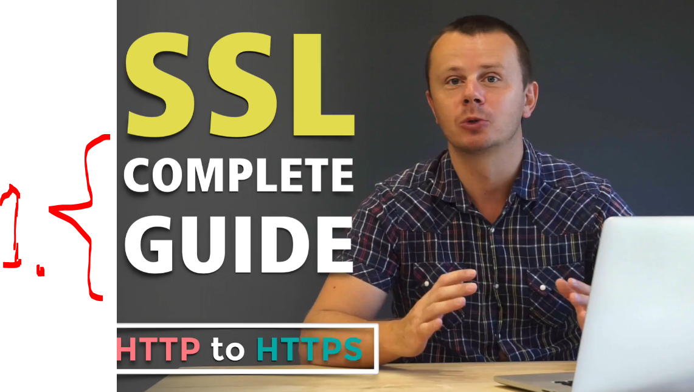

# Section 01: Introduction.

Introduction.

# What I Learned.

# Introduction.

    

1. This course will include:
    - SSL certificates!
    - HTTP and HTTPS!

- The HTTP is considered as unsecured!

-  We will be using **Ubuntu** systems!

# Let's get connected! Join the Learning Community.

- 🎦 YouTube https://www.youtube.com/CodingTutorials
- 🙍 LinkedIn https://www.linkedin.com/in/bogdanstashchuk/
- 📪 Twitter https://twitter.com/BogdanStashchuk
- 🌎 Facebook https://facebook.com/BogdanStashchuk