# Section 02: Introduction to the HTTPS and TLS.

Section 2: Introduction to the HTTPS and TLS.

# What I Learned.

# Section 01 Introduction.

    

1. We will be different security topics!

# Overview of researches dedicated to SSL, TLS and HTTPS.

    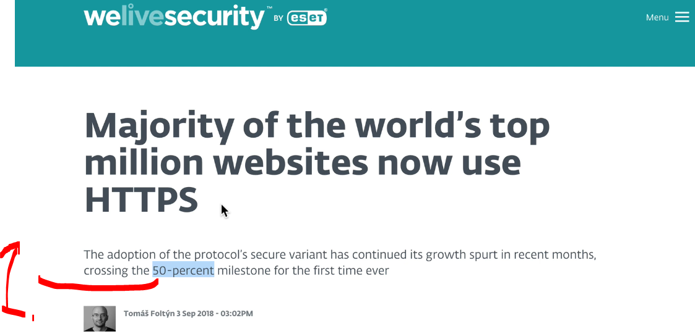

1. **HTTPS** is used more than **50%** in the world!
    - **HTTPS** encrypts traffic!

    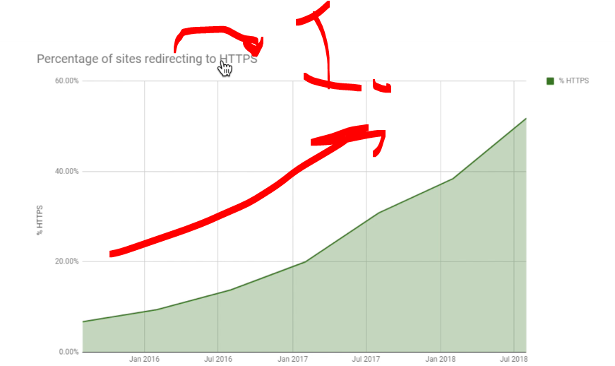

1. Trend of **HTTPS** is growing! 

- We can see SSL statistics:

    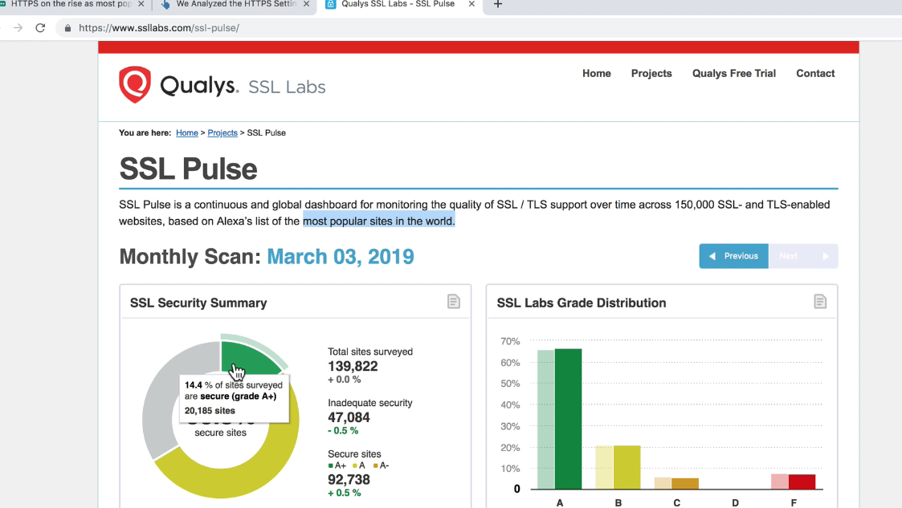

    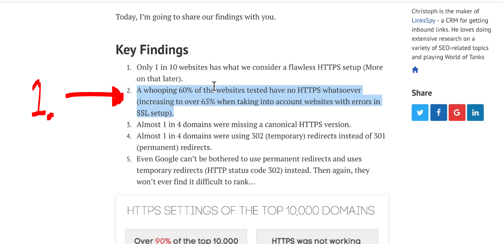

1. In 2016 **60%** did not use **SSL encryption**! 

    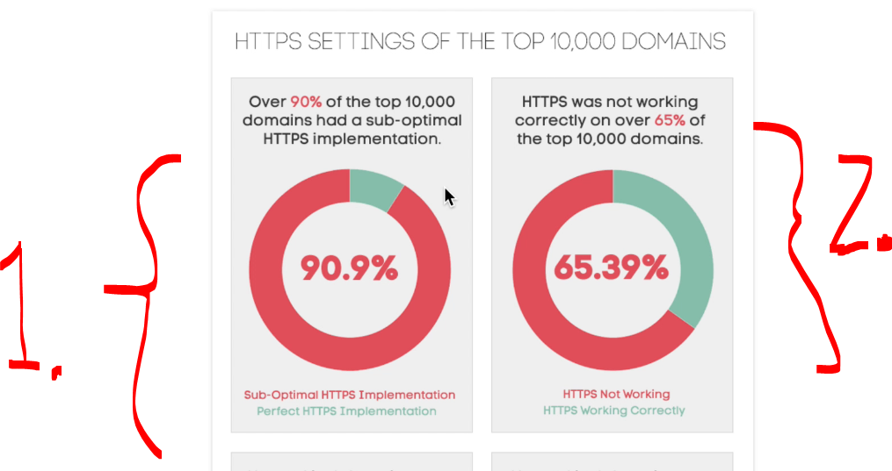

1. In 2016 there was **90%** of the top **10, 000** domains had non-optimal **HTTPS **implementation**!
2. The **HTTPS** was not fully well implemented!

- To **permanently redirect** traffic from **HTTP** to **HTTPS** using a **301 redirect**, you need to add a configuration rule to your web server.

    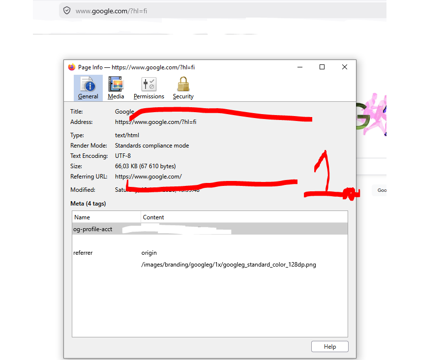

1. Google is secure! One can see the **HTTPS**!

# Overview of the certificates of some popular websites.

- Let's look of the `www.gooogle.com` certificate!

    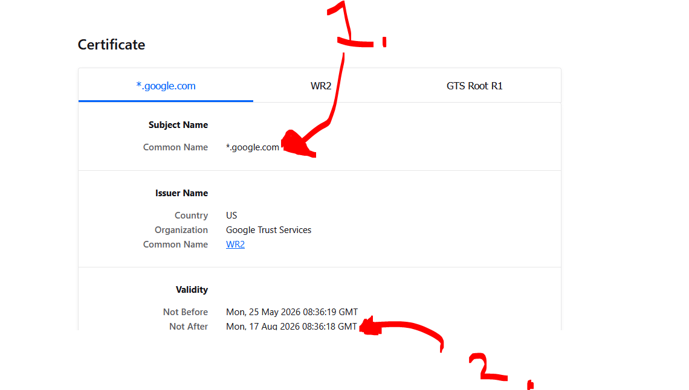

1. `*` is **wildcard**. It means this **single certificate** is **valid** for **any sub-domain** exactly one level below `google.com`.
2. The expiration of the **certificate** is!

- Let's look at the **certificate fingerprints**:

    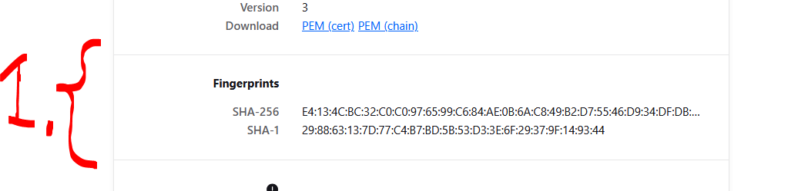

1. These are used for the **hashes** of the **certificate**! The techniques are `SHA-256` and `SHA-1`!
    - This is to **verify** the **authenticity of the certificate**!

# Difference between HTTP and HTTPS.

- Let's visit: `http://httpforever.com/` where is HTTP!

    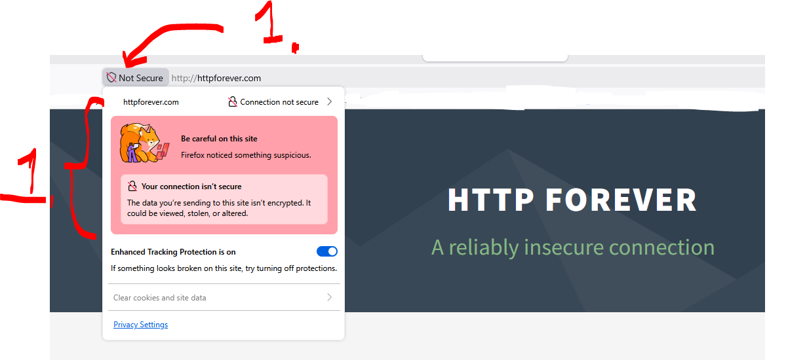

1. We can see that **HTTP** is not secure!

    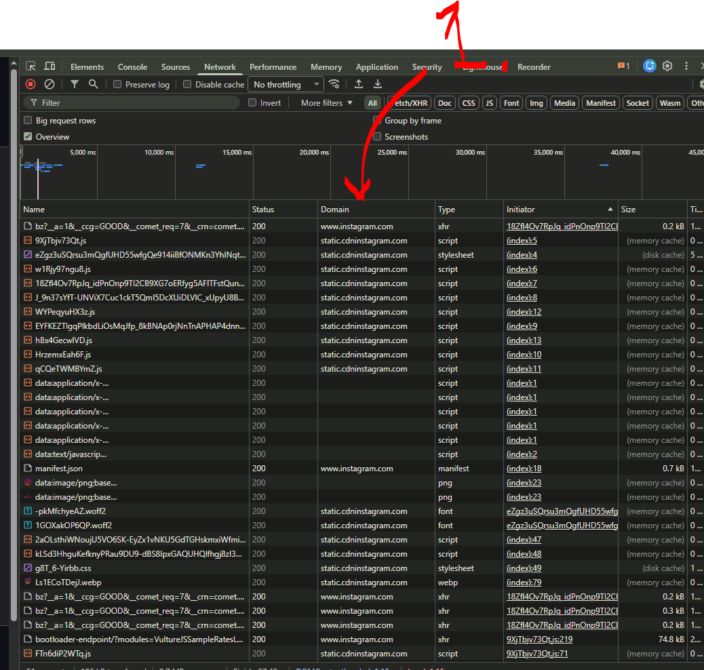

1. In `https://www.instagram.com/`, we can see the **domain**, where they are downloaded from!

    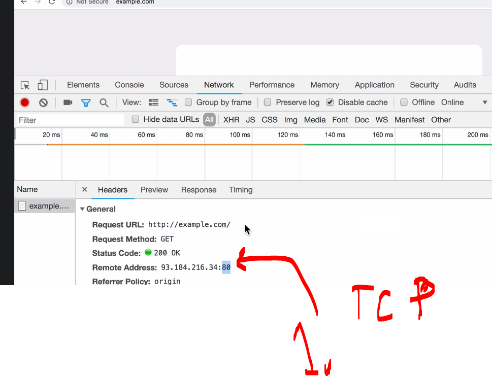

1. We can see **port** being added by the **TCP**! 

- installing wireshark here.

# Analyzing traffic using Wireshark.

# TCP/IP stack by example.

# Analyzing HTTP protocol using Wireshark.

# Analyzing HTTPS and TLS using Wireshark.