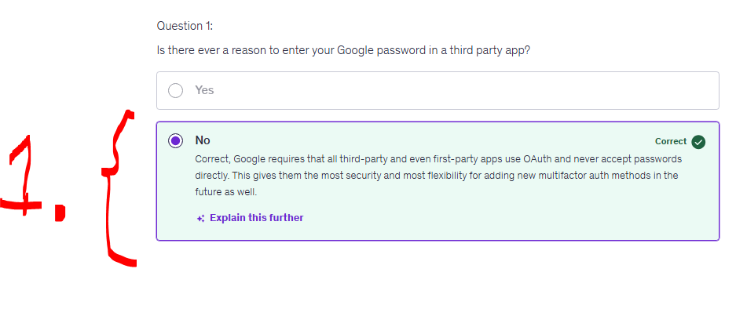
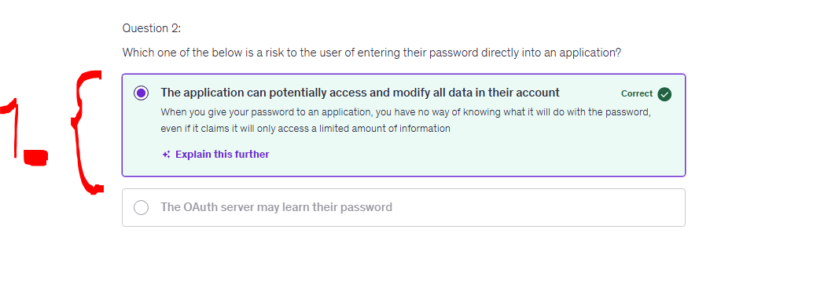
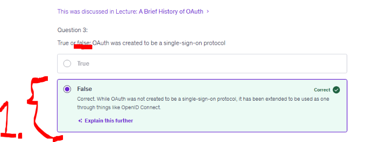
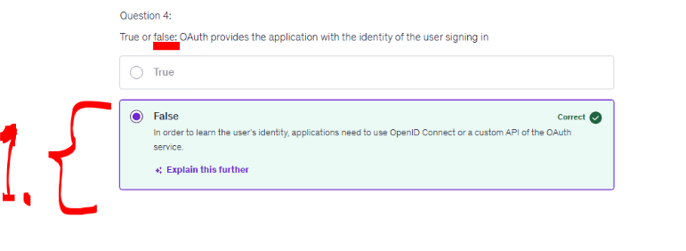
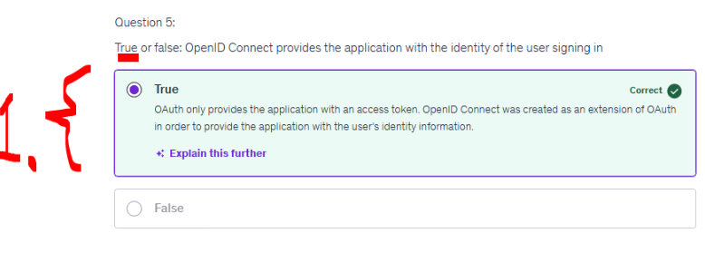
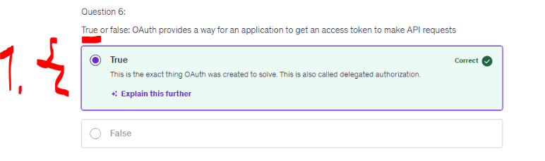
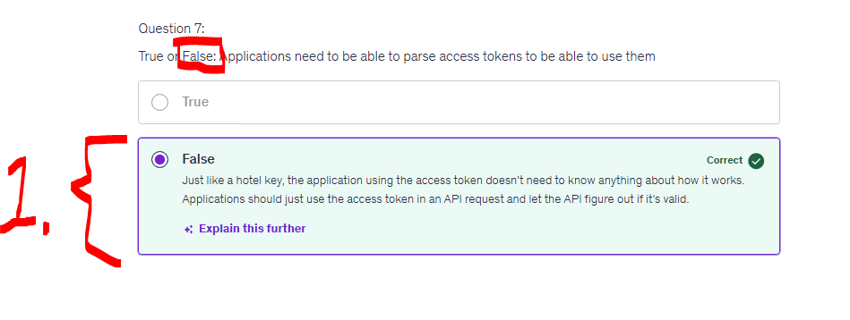

# Section 01: Introduction.

Introduction.

# What I Learned.

# Intro to this Course.

<div align="center">
    
</div>

1. The instructor!

<div align="center">
    
</div>

1. **OAuth** is collection of multiple specs!

<div align="center">
    
</div>

1. This course will have two perspectives:
    - Applications.
        - OAuth.
    - APIs.
        - OAuth.

<div align="center">
    
</div>

1. Multiple ways to deal with OAuth.
    - Server-Side.
    - Mobile/Native.
    - SPA's.

# A Brief History of OAuth.

- Before **OAuth** there was **basic authentication**!

- **Old way** of asking permission!

<div align="center">
    
</div>

1. If one would see following today, would you want to give application your password?
    - **3rd party** was give password to authenticate!
        - Lot of companies implemented their own way to authenticate!
            - They all had different names for things!

- OAuth 1.0 was some troubles with mobile apps.

- Some example using OAuth in **Smart TV**!

<div align="center">
    
</div>

# How OAuth Improves Application Security.

<div align="center">
    
</div>

1. Normally the authentication was handled as following! This would work in relative simple systems!
    - Saved in session cookie!

- This will brake down, when there is need for multiple apps:
    - Single sign on.
    - Mobile app.

- We would need to **save password** in **multiple apps** and forward them into **API's** and **3rd party systems**!

<div align="center">
    
</div>

1. Aspects that User cares about:
    - How user can know trust to Application?
        - One just hopes it will be secure!
    - Authentication if app uses for other applications!
2. Aspects that API cares about:
    - How you distinguish, which one is user and which one is API!
    - If API's is are added more authentication methods, this needs to be added for every API separately.

- **OAuth** tries to solve this by making user to type password for the **OAuth** server, not the app server!
    - This token is then passed for the application to use!


# OAuth vs OpenID Connect.

- **OAuth**:
    - Was designed to access to API.
        - No need to identify who is accessing.

- **OpenID**:
    - Built on top of OAuth 2.0.

<div align="center">
    
</div>

1. We can think of **Oauth** like the key card for the hotel room! Door does not **need** to know who opener is!
    - **Front desk**, checks your ID!
        - **Front desk** is behaving like **authentication** server!
        - **Card** is behaving like **access token**!
            - **Key card** will have what it **can open** and **how long its working**!
        - **Door** is behaving like **resource server**!

<div align="center">
    
</div>

1. **OpenID** is extension for the **OAuth** that provides **user information**!
    - Since names etc ...
    - **OAuth** uses **Access tokens**!
    - **OpenID** uses **ID tokens**!
        - This tells about the users!

<div align="center">
    
</div>

# Quiz 01: The Basics.

<details>
<summary id="Question_01" open="true"> <b>Question 01.</b> </summary>

````yaml
Question 01:
Is there ever a reason to enter your Google password in a third party app?
````

- My answer:

<div align="center">
    
</div>

1. Yes, Google enforces use of **OAuth** passwords when logging into 3rd party software!

</details>

<details>
<summary id="Question_02" open="true"> <b>Question 02.</b> </summary>

````yaml
Question 02:
Which one of the below is a risk to the user of entering their password directly into an application?
````

- My answer:

<div align="center">
    
</div>

1. When user gives password to app. There is no way what they will do with your password!

</details>

<details>
<summary id="Question_03" open="true"> <b>Question 03.</b> </summary>

````yaml
Question 03:
True or false: OAuth was created to be a single-sign-on protocol?
````

- My answer:

<div align="center">
    
</div>

1. **False**, it was, but not only it was extended later to service multiple types!

</details>

<details>
<summary id="Question_04" open="true"> <b>Question 04.</b> </summary>

````yaml
Question 04:
True or false: OAuth provides the application with the identity of the user signing in?
````

- My answer:

<div align="center">
    
</div>

1. **False**, OpenID provides the user identity!

</details>

<details>
<summary id="Question_05" open="true"> <b>Question 05.</b> </summary>

````yaml
Question 05:
True or false: OpenID Connect provides the application with the identity of the user signing in?
````

- My answer:

<div align="center">
    
</div>

1. **True**, OpenID provides user identity information!

</details>

<details>
<summary id="Question_06" open="true"> <b>Question 06.</b> </summary>

````yaml
Question 06:
True or false: OAuth provides a way for an application to get an access token to make API requests?
````

- My answer:

<div align="center">
    
</div>

1. **True**, OAuth delegates the authorization!

</details>

<details>
<summary id="Question_07" open="true"> <b>Question 07.</b> </summary>

````yaml
Question 07:
True or False: Applications need to be able to parse access tokens to be able to use them
````

- My answer:

<div align="center">
    
</div>

1. **False**, applications typically just store the token and send it in API requests. The resource server/API validates and interprets the token.

</details>
