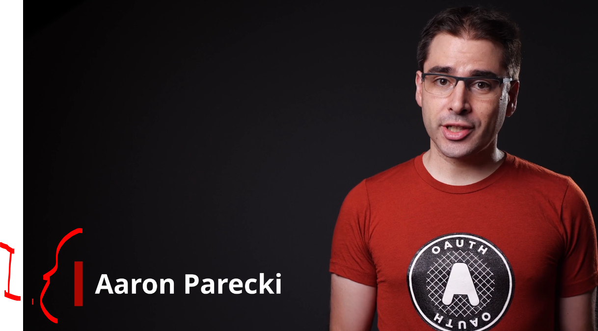
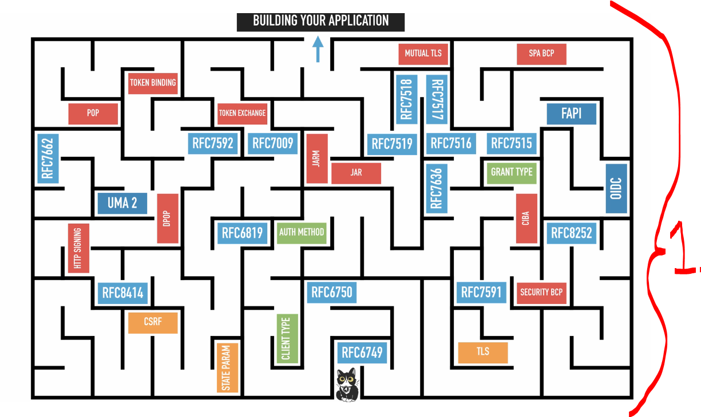
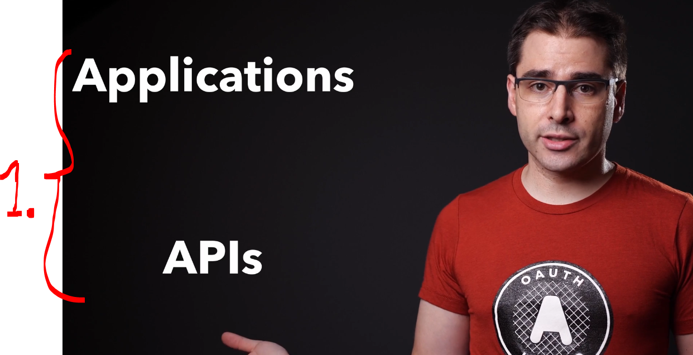
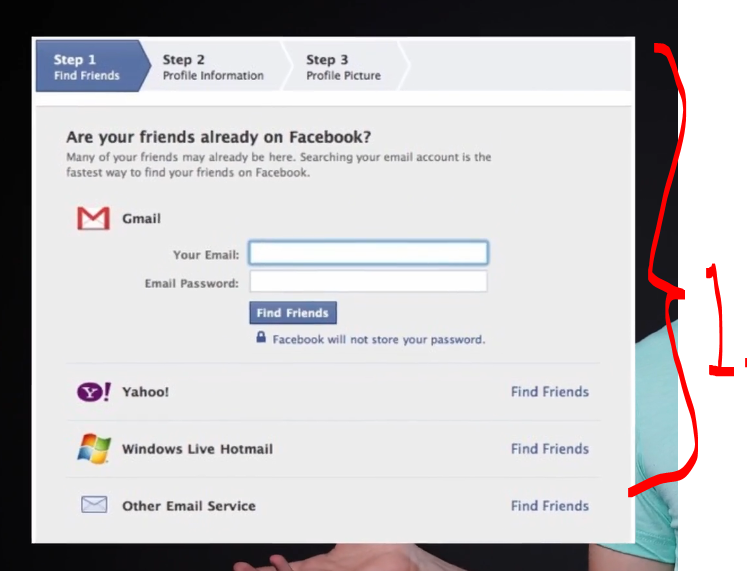
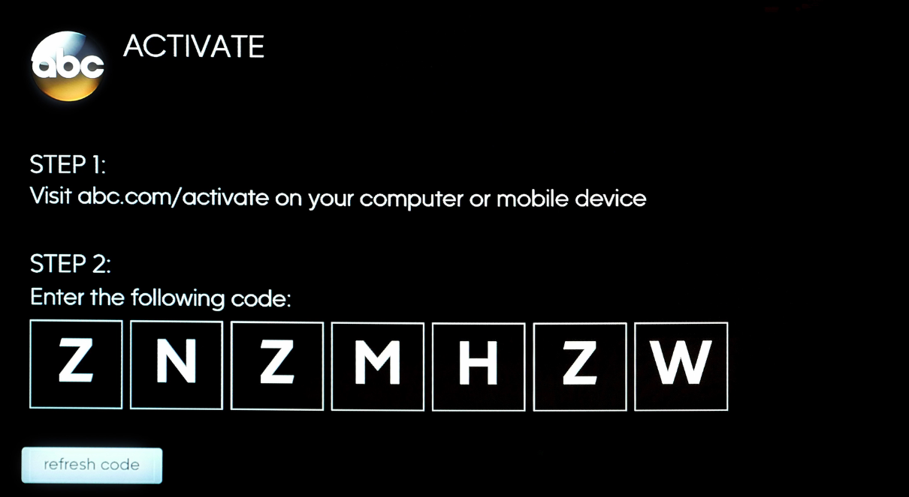
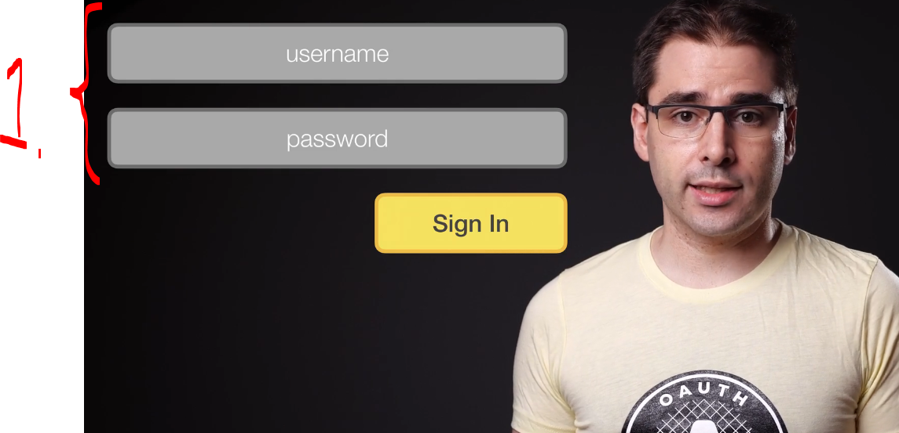
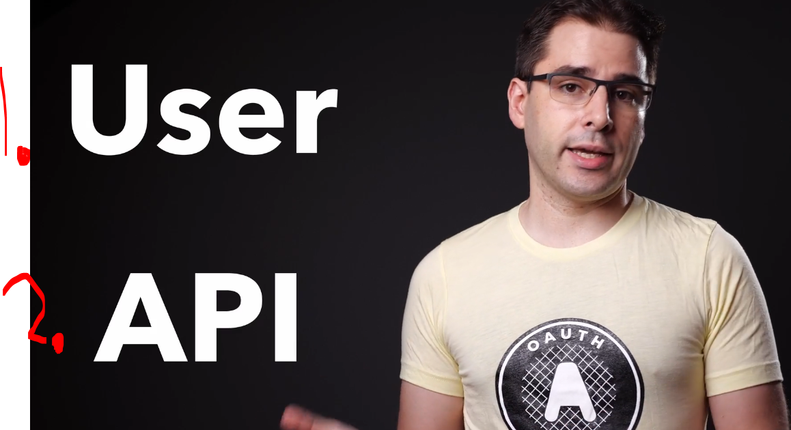
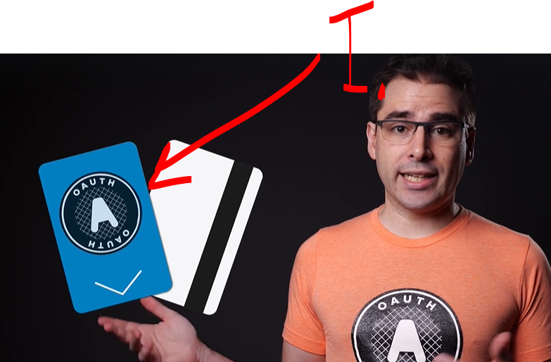
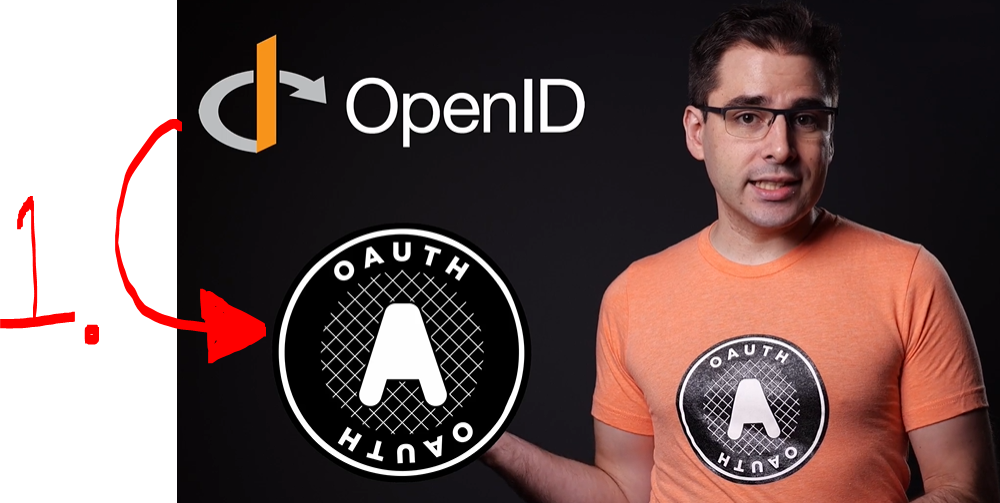
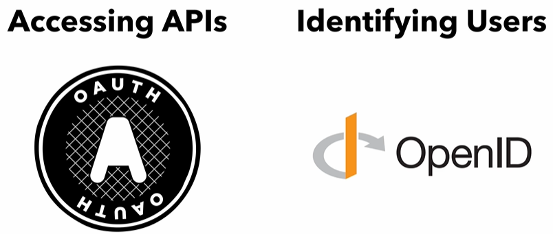

# Section 01: Introduction.

Introduction.

# What I Learned.

# Intro to this Course.

    

1. The instructor!

    

1. **OAuth** is collection of multiple specs!

    

1. This course will have two perspectives:
    - Applications.
        - OAuth.
    - APIs.
        - OAuth.

    

1. Multiple ways to deal with OAuth.
    - Server-Side.
    - Mobile/Native.
    - SPA's.

# A Brief History of OAuth.

- Before **OAuth** there was **basic authentication**!

- **Old way** of asking permission!

    

1. If one would see following today, would you want to give application your password?
    - **3rd party** was give password to authenticate!
        - Lot of companies implemented their own way to authenticate!
            - They all had different names for things!

- OAuth 1.0 was some troubles with mobile apps.

- Some example using OAuth in **Smart TV**!

    

# How OAuth Improves Application Security.

    

1. Normally the authentication was handled as following!
    - Saved in session cookie!

- This will brake down, when there is need for multiple apps:
    - Single sign on.
    - Mobile app.

- We would need to **save password** in **multiple apps**!

    

1. Aspects that User cares about:
2. Aspects that API cares about:

# OAuth vs OpenID Connect.

- **OAuth**:
    - Was designed to access to API.
        - No need to identify who is accessing.

- **OpenID**:

    

1. We can think of **Oauth** like the key card for the hotel room! Door does not **need** to know who opener is!
    - **Front desk**, checks your ID!
        - **Front desk** is behaving like **authentication** server!
        - **Card** is behaving like **access token**!
            - **Key card** will have what it **can open** and **how long its working**!
        - **Door** is behaving like **resource server**!

    

1. **OpenID** is extension for the **OAuth** that provides **user information**!
    - Since names etc ...
    - **OAuth** uses **Access tokens**!
    - **OpenID** uses **ID tokens**!
        - This tells about the users!

    

# Quiz 01: The Basics.