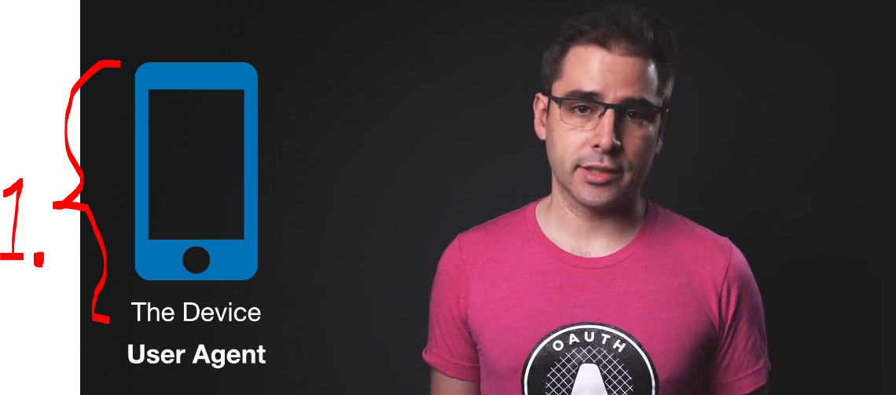

# Section 02: API Security Concepts.

API Security Concepts. 

# What I Learned.

# Roles in OAuth.

- 4 Roles in **OAuth** server:

<div align="center">
    
</div>


# Application Types.

# User Consent.

# Front Channel vs Back Channel.

# Quiz 02: Front Channel vs Back Channel.


<details>
<summary id="Question_01" open="true"> <b>Question 01.</b> </summary>

````yaml
Question 01:

````

- My answer:

<div align="center">
    
</div>

1. 

</details>

<details>
<summary id="Question_02" open="true"> <b>Question 02.</b> </summary>

````yaml
Question 02:
````

- My answer:

<div align="center">
    
</div>

1. 

</details>


# Application Identity.

# Quiz 03: API Security Concepts.


<details>
<summary id="Question_01" open="true"> <b>Question 01.</b> </summary>

````yaml
Question 01:

````

- My answer:

<div align="center">
    
</div>

1. 


</details>

<details>
<summary id="Question_02" open="true"> <b>Question 02.</b> </summary>

````yaml
Question 02:
````

- My answer:

<div align="center">
    
</div>

1. 

</details>

<details>
<summary id="Question_03" open="true"> <b>Question 03.</b> </summary>

````yaml
Question 03:
````

- My answer:

<div align="center">
    
</div>

1.

</details>

<details>
<summary id="Question_04" open="true"> <b>Question 04.</b> </summary>

````yaml
Question 04:
````

- My answer:

<div align="center">
    
</div>

1. 

</details>

<details>
<summary id="Question_05" open="true"> <b>Question 05.</b> </summary>

````yaml
Question 05:
````

- My answer:

<div align="center">
    
</div>

1. 

</details>

<details>
<summary id="Question_06" open="true"> <b>Question 06.</b> </summary>

````yaml
Question 06:
````

- My answer:

<div align="center">
    
</div>

1. 

</details>

<details>
<summary id="Question_07" open="true"> <b>Question 07.</b> </summary>

````yaml
Question 07:
````

- My answer:

<div align="center">
    
</div>

1. 

</details>

<details>
<summary id="Question_08" open="true"> <b>Question 08.</b> </summary>

````yaml
Question 08:
````

- My answer:

<div align="center">
    
</div>

1. 

</details>

<details>
<summary id="Question_09" open="true"> <b>Question 09.</b> </summary>

````yaml
Question 09:
````

- My answer:

<div align="center">
    
</div>

1. 

</details>


<details>
<summary id="Question_10" open="true"> <b>Question 10.</b> </summary>

````yaml
Question 10:
````

- My answer:

<div align="center">
    
</div>

1. 

</details>
