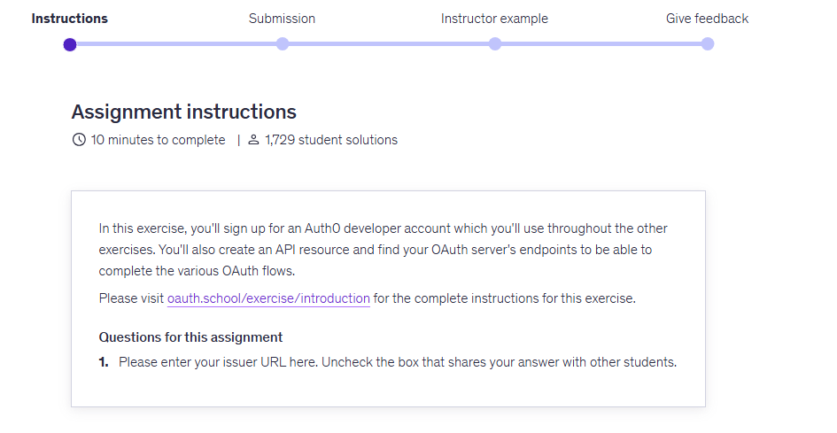
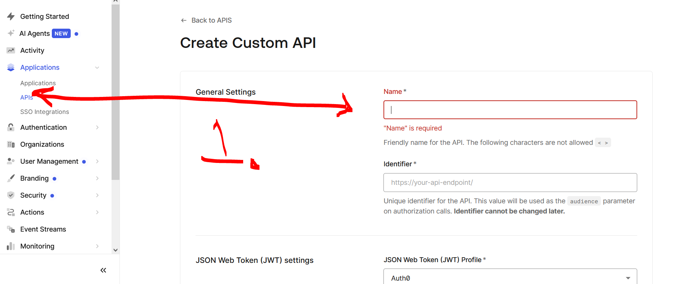

# Section 03: OAuth Clients.

OAuth Clients.

# What I Learned.

# Introduction.

<div align="center">
    
</div>

1. **Client** is making **API requests**!

# Assignment 01: Preparing for the Exercises.

<details>
<summary id="assignment_01_preparing_for_the_exercises" open="true"> <b>Assignment 01: Preparing for the Exercises! My Answer!</b> </summary>

<div align="center">
    
</div>

<div align="center">
    
</div>

1. We create API here!

- **Question 1:** Please implement `MinMaxMetrics` below:`
    - **Answer:** Below:

```Java

```

</details>
