# Section 04: OAuth for Server-Side Applications.

OAuth for Server-Side Applications. 

# What I Learned.

# Introduction.

# Registering an Application.

> [!NOTE]
> Application registration = creating a trusted client in the Authorization Server and obtaining a **Client ID** (and sometimes a **Client Secret**).

- When we register the OAuth with given **Authorization Server**!

- What you provide during registration typically:
    - Application name.
    - Redirect URI(s).
        - Example of redirect URI `https://myapp.example.com/callback`.
    - Application type (web, mobile, SPA, etc.).
    - Contact information (optional).

- Without **registration**, the Authorization Server would not know:
    - Which app is requesting access.
    - Which redirect URIs are allowed.
    - Whether the app is public or confidential.
- Hacker can't start OAuth flow and redirect to attackers website!
    - Redirect hack!

<div align="center">
    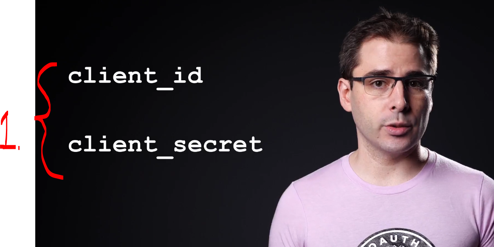
</div>

1. Once registered with the **Authorization Server**, we might get `client_id` and `client_secret`. We might get:
    ````Xml
    Client ID: abc123
    Client Secret: xyz789
    ````
    - The `Client ID` identifies your application. 
        - **Public information**, can be in **source code**!
    - The `Client Secret` is like a password for confidential clients (e.g., backend web apps). Public clients such as mobile apps and SPAs typically do not use a client secret and instead use PKCE.
        - **Depends, can add**:
            - Confidential clients (server-side apps).
                - Backend web applications.
                - Server-to-server services.
            - You **can store** the **client secret** on the **server** because users cannot access it.
        - **Depends, cannot add**:
            - Public clients (mobile apps, SPAs, desktop apps).
             - **Do not store** a **client secret** in these apps.
                - JavaScript bundles
                - Mobile app binaries
                - Desktop app executables
            - Can eventually be extracted by users.

# Authorization Code Flow for Web Applications.

<div align="center">
    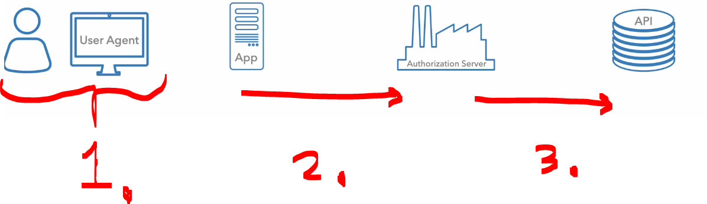
</div>

1. User needs to access App.
    - Browser never receives tokens directly, this should be done in app backend server.
2. App needs token from OAuth server.
3. To make API requests.

<div align="center">
    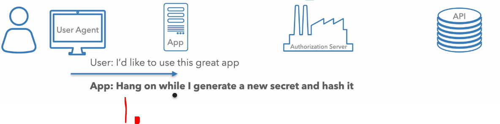
</div>

1. User clicking login button!
    - Before redirecting.
        - It goes to **App** create **new secret** and **hashes it** for this particular flow!

<div align="center">
    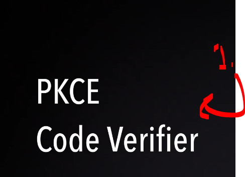
</div>

1. **PKCE** generates **Code Verifier**!

<div align="center">
    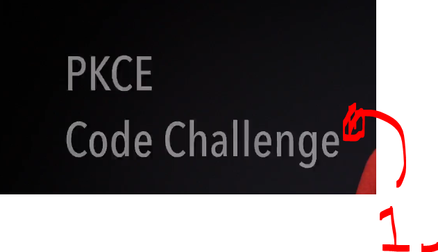
</div>

1. **PKCE** generates **Code Challenge**!  

<div align="center">
    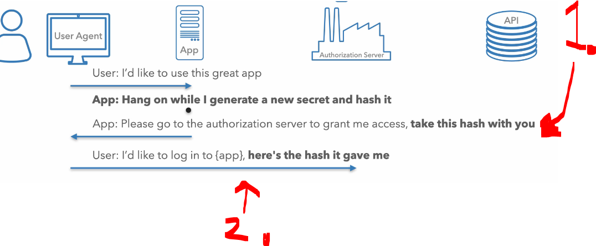
</div>

1. **App** generates the **hash** and returns it to the browser!
2. **User browser** carrying that **hash** to the **OAuth server**
    - This is **used** in **front channel**!
        - This is the reason why we are using the **hash**, when sending request thought the **User browser**! We are not sending the secret itself!

<div align="center">
    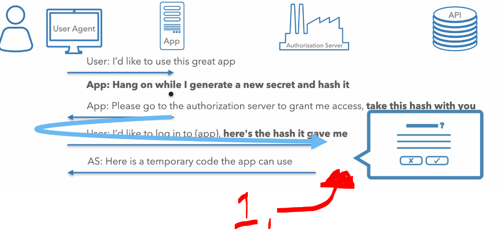
</div>

1. User is asked to log in in **OAuth server**! After the user logs in, the **Authorization Server** redirects back with an **authorization code**.

<div align="center">
    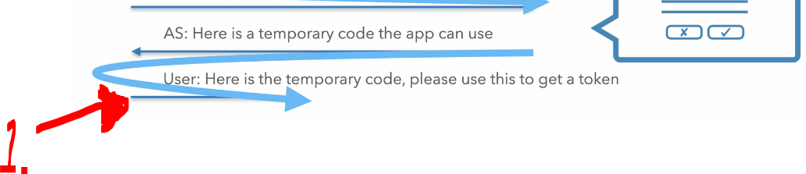
</div>

1. **OAuth** returns the **temporary code** that can be used to get a token!

<div align="center">
    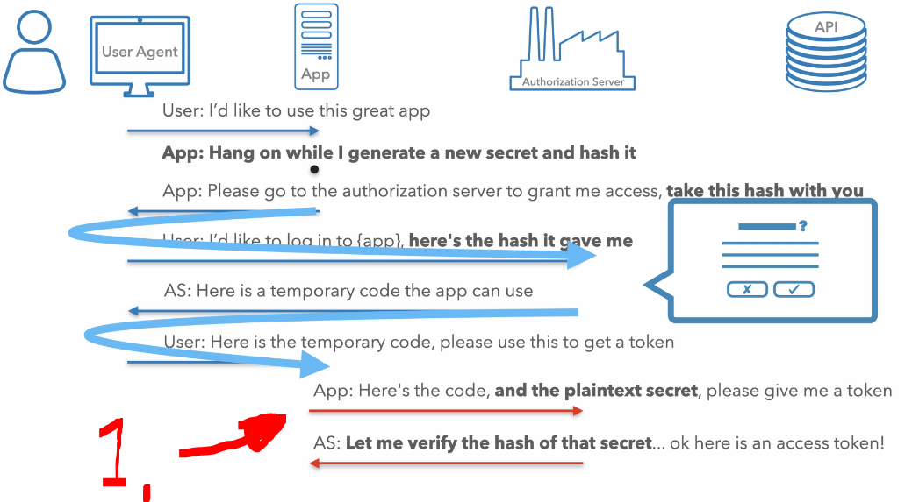
</div>

1. Now we can get request for **access token** from the **App server side**. This includes:
    ````Json
    POST /token
    Content-Type: application/x-www-form-urlencoded

    grant_type=authorization_code
    code=AUTH_CODE
    redirect_uri=https://app.com/callback
    client_id=CLIENT_ID
    client_secret=CLIENT_SECRET
    ````
    - If using **PKCE**, you also send `code_verifier` instead of relying on a ä`client_secret`.
    - The OAuth server will reply with the **tokens**!
    ````Json
    {
    "access_token": "ACCESS_TOKEN",
    "refresh_token": "REFRESH_TOKEN",
    "expires_in": 3600
    }
    ````

- **PKCE** is recommended to use!

<div align="center">
    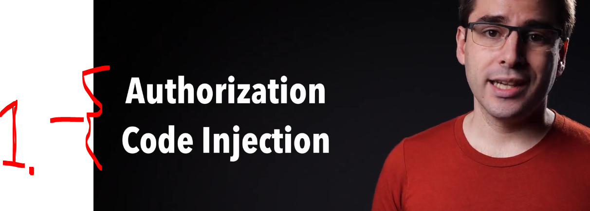
</div>

1. **PKCE** should be used, to prevent this type of attack!

- Let's go thought the flow in practice:

<div align="center">
    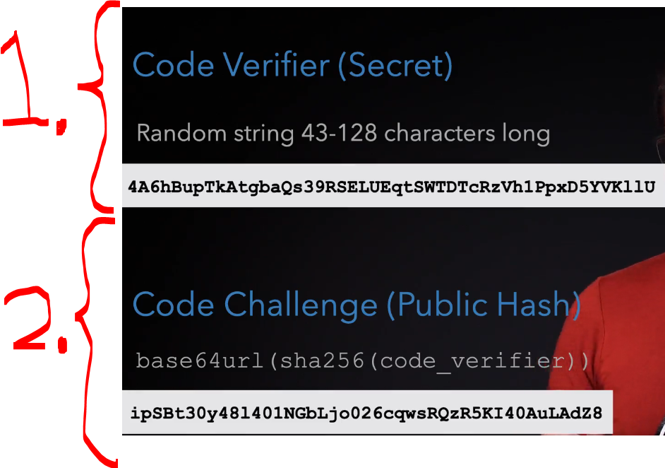
</div>

1. **Code Verifier** (Secret) random string!
2. **Cade Challenge** (Publish Hash) `base64url(sha256(code_verifier))`!

- Now we are ready to **send user** to OAuth server!

<div align="center">
    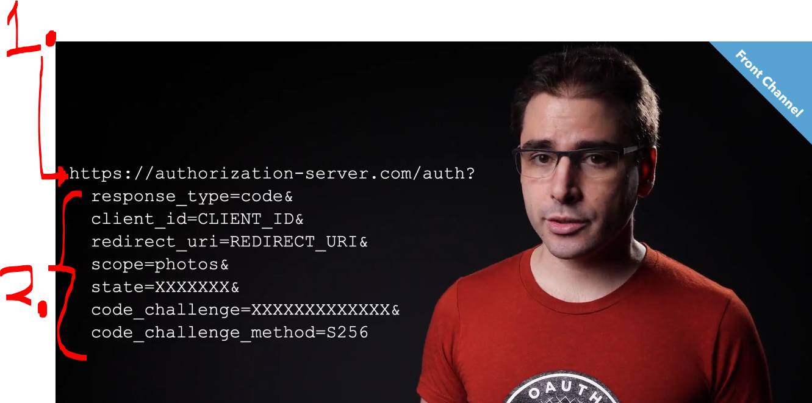
</div>

1. Find **authorization endpoint** from:
    - Document! 
    - OAuth metadata URL to find it!
        - Use OpenID Connect **Discovery** (recommended)!
2. Rest of the **query string**:
    - `response_type=code` - Request an **authorization code**! We want **authorization code**!
    - `client_id` - Identifies the application! Add your apps **client_id**!
    - `redirect_uri` - Where to send the user back! This has to match, ones which you registered the app!
    - `scope` - Permissions being requested!
    - `state` - **CSRF** protection! **PKCE** provides this protection also! 
    - `code_challenge` - **PKCE** challenge (if using **PKCE**)!
    - `code_challenge_method=S256` - **PKCE** hashing method!
- Example parameters:
    ````JSON
    https://authorization-server.com/auth?
    response_type=code&
    client_id=CLIENT_ID&
    redirect_uri=REDIRECT_URI&
    scope=photos&
    state=XXXXXXX&
    code_challenge=XXXXXXXXXXXX&
    code_challenge_method=S256
    ````

- Next User is asked to log in:

<div align="center">
    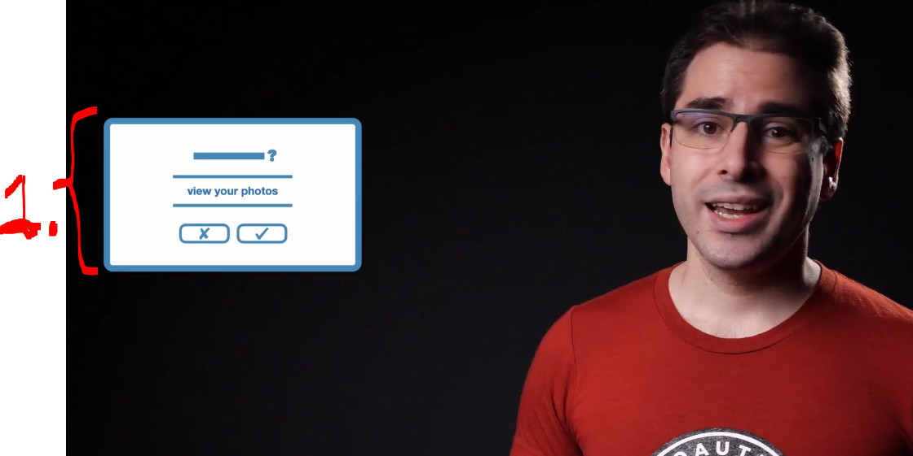
</div>

1. User logs in and OAuth approves the request!
    - OAuth return **onetime** authorization code!

<div align="center">
    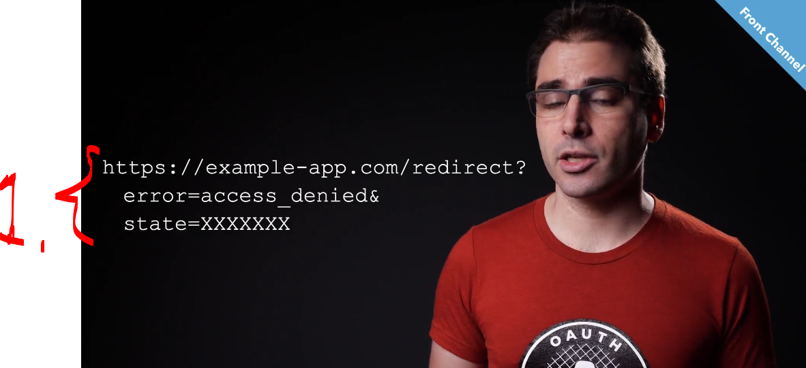
</div>

1. If, there was **error** this will be **returned**!

<div align="center">
    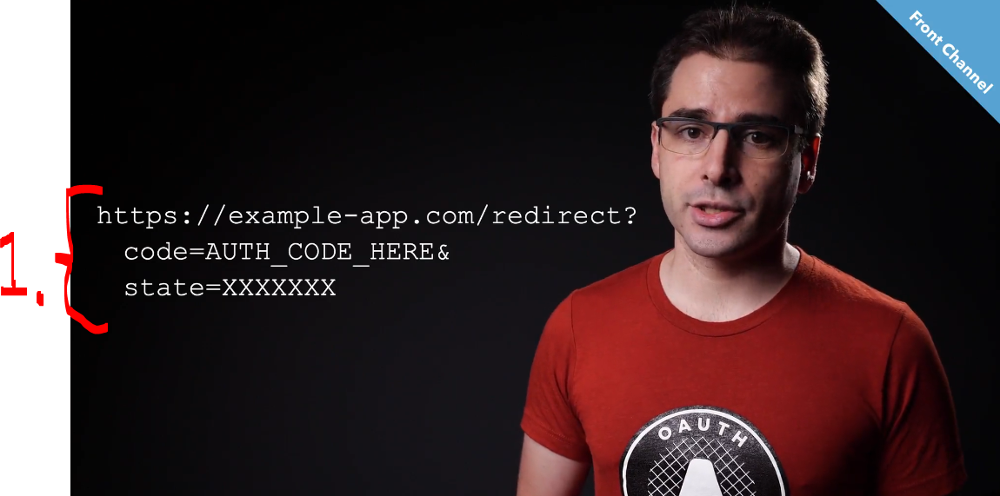
</div>

1. If, the authorization call was **successful**! We get:
    - Authorization **code**!
    - **State** value matches with the one, which was sent when request was made!


- Next, we will need to make call from our **backend server** to **OAuth** server endpoint!

<div align="center">
    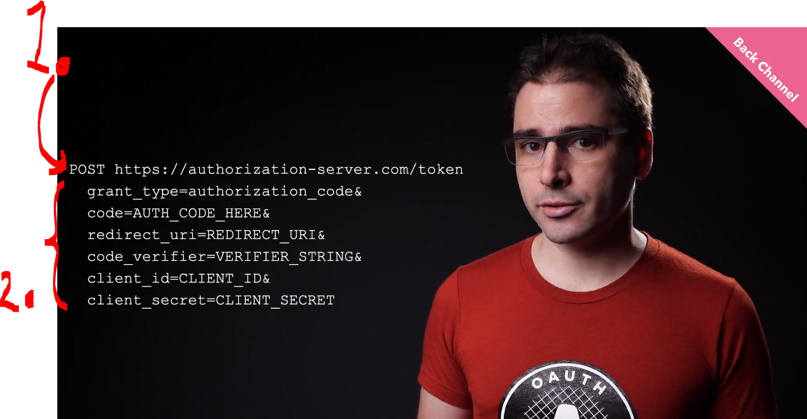
</div>

1. This endpoint is needed to check from the documents or discovery channel!
2. Rest of the **query string**:
    - `grant_type=authorization_code`. Tells the server you're exchanging an **authorization code**.
    - `code`. The temporary code received from `/authorize`, which we got in previous call!
    - `redirect_uri`. Where to send the user back! This has to match, ones which you registered the app!
    - `code_verifier`.	**PKCE** secret generated before login. This was done in beginning!
        - Applications credentials (This can wary on the server. Should it be in **HTTP header** or in **POST Body**):
            - `client_id`. Your application's ID.
            - `client_secret`. Your application's secret (for confidential clients).
- Example parameters:
    ````Json
    grant_type=authorization_code
    code=AUTH_CODE_HERE
    redirect_uri=REDIRECT_URI
    code_verifier=VERIFIER_STRING
    client_id=CLIENT_ID
    client_secret=CLIENT_SECRET
    ````

- The authorization server will return the **access token**!

<div align="center">
    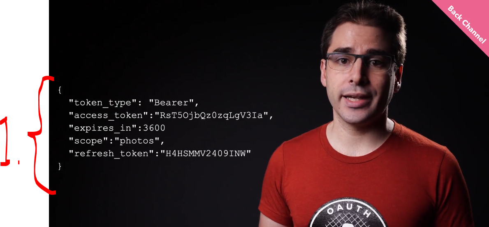
</div>

1. Returned **access token**:
    - `token_type: "Bearer"` **Type of token**.
    - `access_token` This is the **main credential** used to authenticate API requests.
    - `expires_in: 3600` The access token expires in 3600 seconds.
    - `scope: "photos"` This limits what the token can access — in this case, only photo-related permissions.
    - `refresh_token` This is a longer-lived secret used to request a new access token when the current one expires. **OPTIONAL**!
        - No need to go through whole flow again!
- Example JSON returned:
    ````Json
    {
    "token_type": "Bearer",
    "access_token": "RsT5OjbQz0zqLgV3Ia",
    "expires_in": 3600
    "scope": "photos",
    "refresh_token": "H4HSMMV2409INW"
    }
    ````

- There can be endpoint for **refresh token**:

<div align="center">
    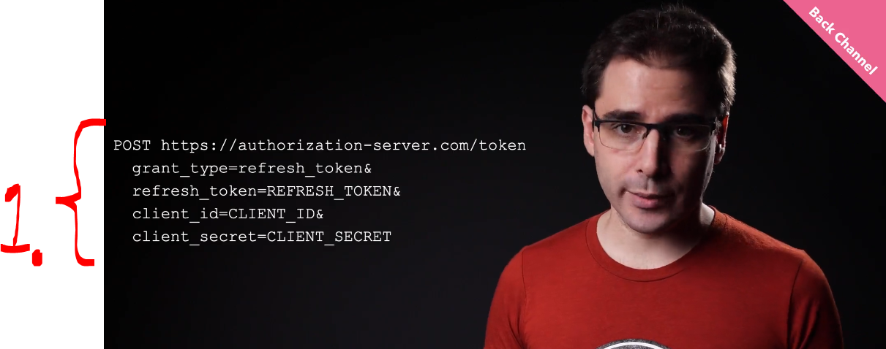
</div>

1. todo

- todo some flow
<br>

<div align="center">
    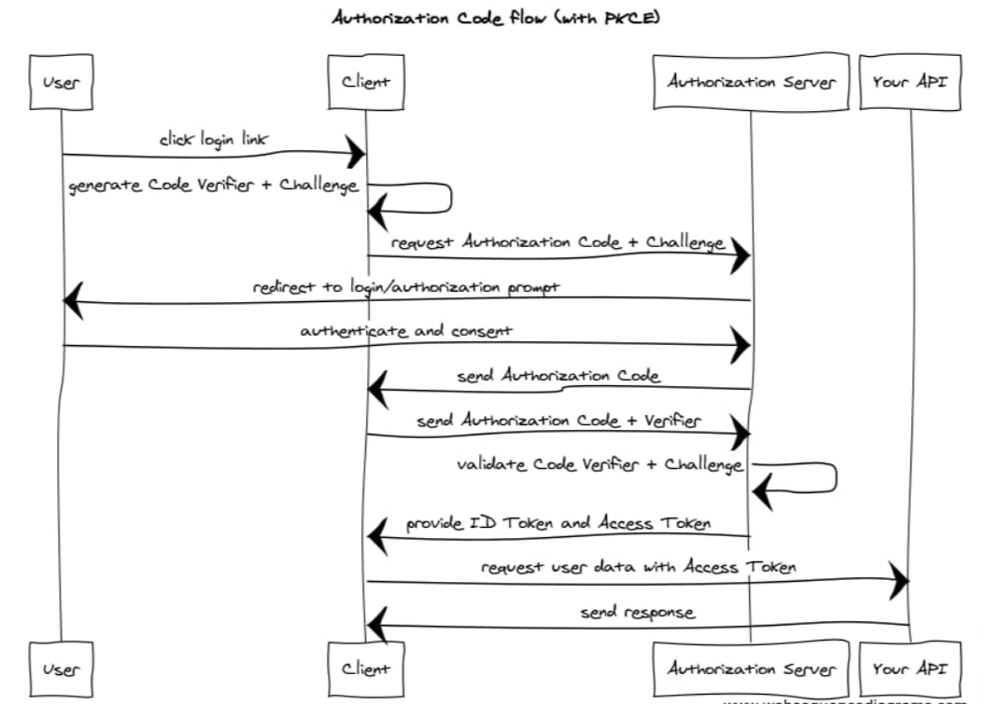
</div>


# Assignment 02: OAuth for Web Server Applications.