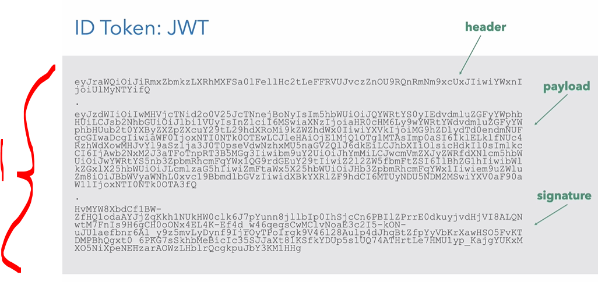
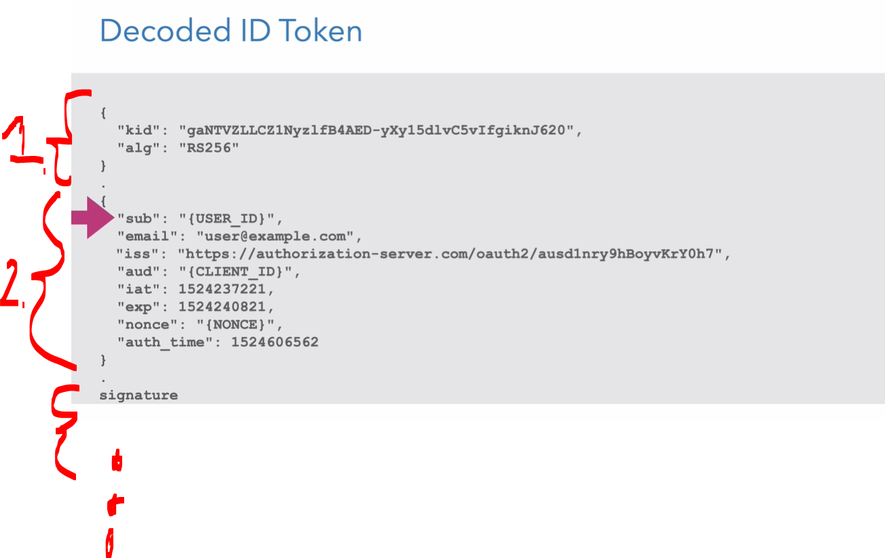
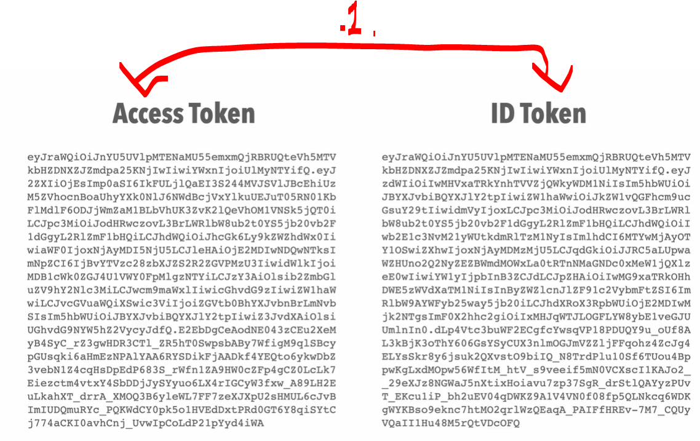
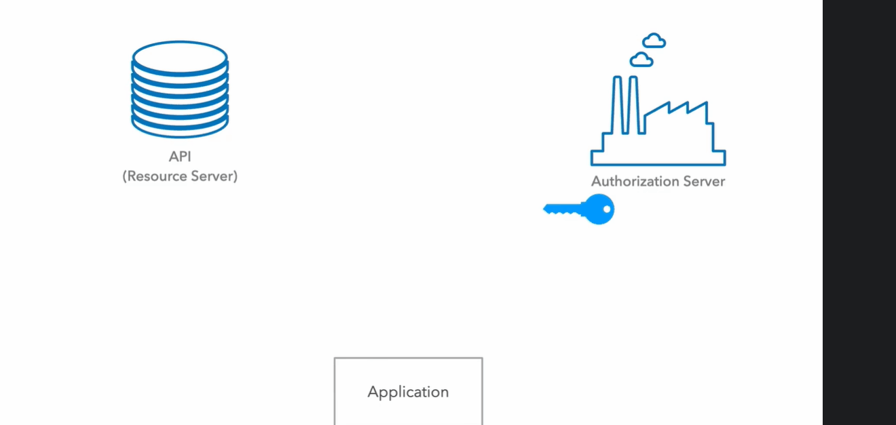
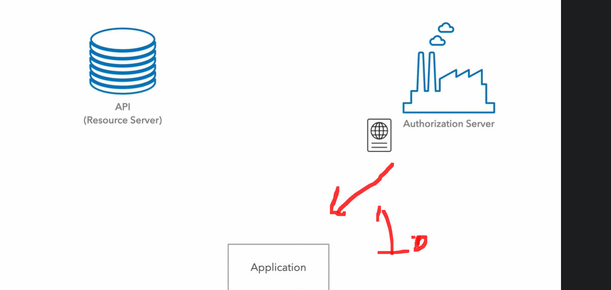
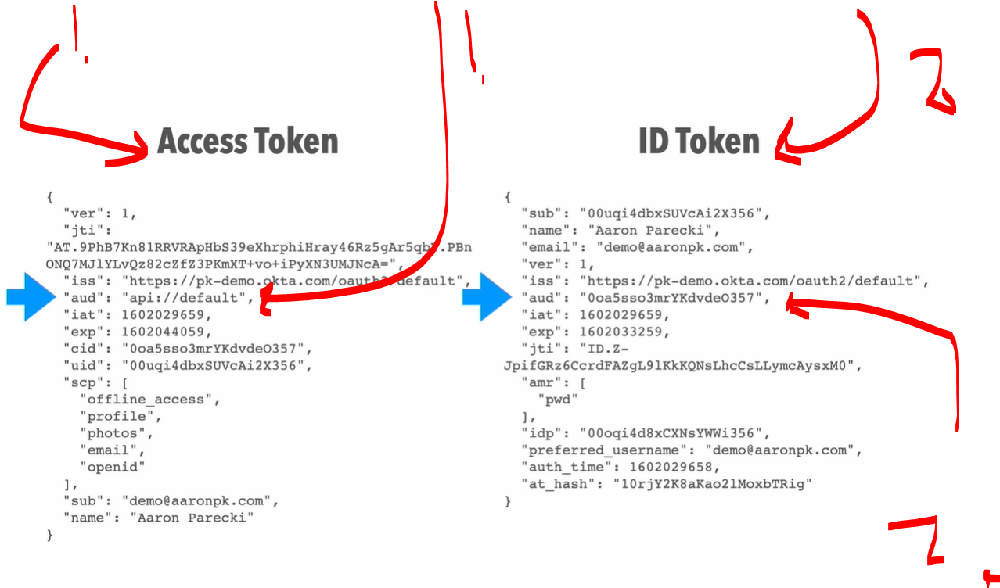
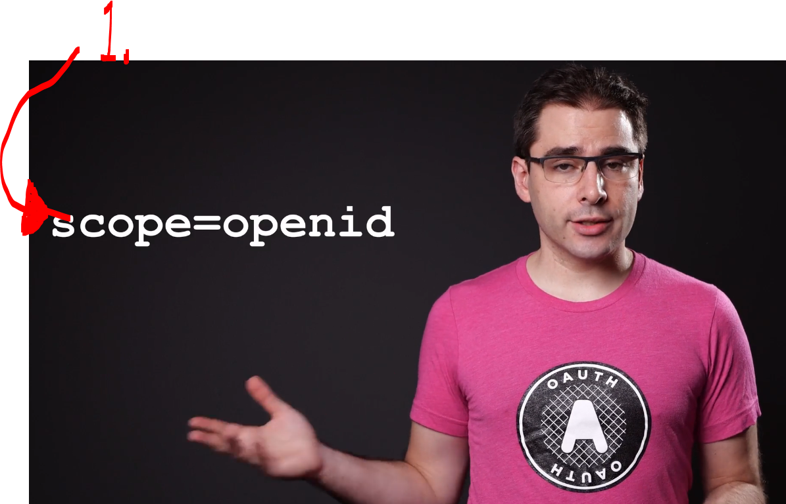
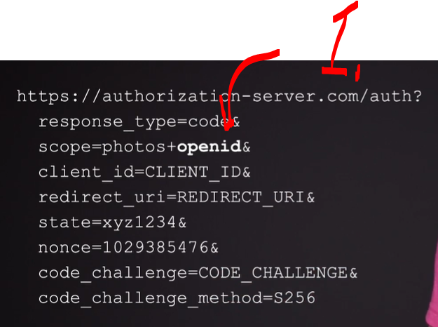

# Section 09 - Introduction to OpenID Connect.

Introduction to OpenID Connect.

# What I Learned.

# What is an ID Token.

- **ID tokens** are **JWT tokens**.

<div align="center">
    
</div>

1.  There is the **header**, **payload** and **signature** part!
    - These **base64** coded headers!

- Once we are running the brought the **base64** decoder!

<div align="center">
    
</div>

1. This is about the **token**!
````Json
{
  "kid": "gaNTVZLLCZI1NyzlfB4AED-yXy15dlvC5vIfgiknJ620",
  "alg": "RS256"
}
````
2. This is about the **payload**.
    - `iss` about the issuer if the token!
    - `aud` identify the user of the token!
    - `iat` is Unix **timestamp** when it was issued!
    - `exp` is Unix **timestamp** when it will be expired!
    - `sub` The unique identifier for the user (`{USER_ID}`).
````Json
{
  "sub": "{USER_ID}",
  "email": "user@example.com",
  "iss": "https://authorization-server.com/oauth2/ausd1nry9hBoyvKrY0h7",
  "aud": "{CLIENT_ID}",
  "iat": 1524237221,
  "exp": 1524240821,
  "nonce": "{NONCE}",
  "auth_time": 1524606562
}
````
3. The signature is the security guard of the **JSON Web Token** (**JWT**). Its entire job is to ensure that the token hasn't been **tampered** with while traveling across the internet.
````Json
signature
````

# How ID Tokens are Different from Access Tokens.

<div align="center">
    
</div>

1. Often time the `access token` and `ID token` is the same, the token looks the same!
    - They are not the **same thing**!

- **Access token** to used to make **API calls**! Getting the key from **Authorization Server**!
    - The **client simply** receives the **token** and **sends it** with **API requests**.
    - Only the Authorization Server and/or **Resource Server** need to **understand** and **validate** it.

<div align="center">
    
</div>

- **ID token** is ment to understood by the application! Getting the key from **Authorization Server**!

<div align="center">
    
</div>

1.  **Application** gets the **ID token** and unpack it
    - Validate the **claim**!
    - Validate the **signature**!

<div align="center">
    
</div>

1. For the **Access Token** there is different the `aud` field!
    - **Audience** for the **Access Token** is the **API**!
2. For the **ID token** there is different the `aud` field!
    - **Audience** for the **ID token** is the **Application** itself!
        - Application needs to know how to validate **ID tokens**!

- Not all the **OAuth** server would use the **access tokens** format as **JWT**!

# Obtaining an ID Token.

- How to obtain `id_token`?
    - Most popular is to use **Authorization Code Flow** (Recommended)!

<div align="center">
    
</div>

1. To get `id_token` we can add `scope=openId` to ken  

<div align="center">
    
</div>

````Bash
https://authorization-server.com/auth?
  response_type=code&
  scope=photos+openid&
  client_id=CLIENT_ID&
  redirect_uri=REDIRECT_URI&
  state=xyz1234&
  nonce=1029385476&
  code_challenge=CODE_CHALLENGE&
  code_challenge_method=S256
````


# Hybrid OpenID Connect Flows.

# Validating and Using an ID Token.

# Assignment 06: Getting the User's Name and Email Address using OpenID Connect.